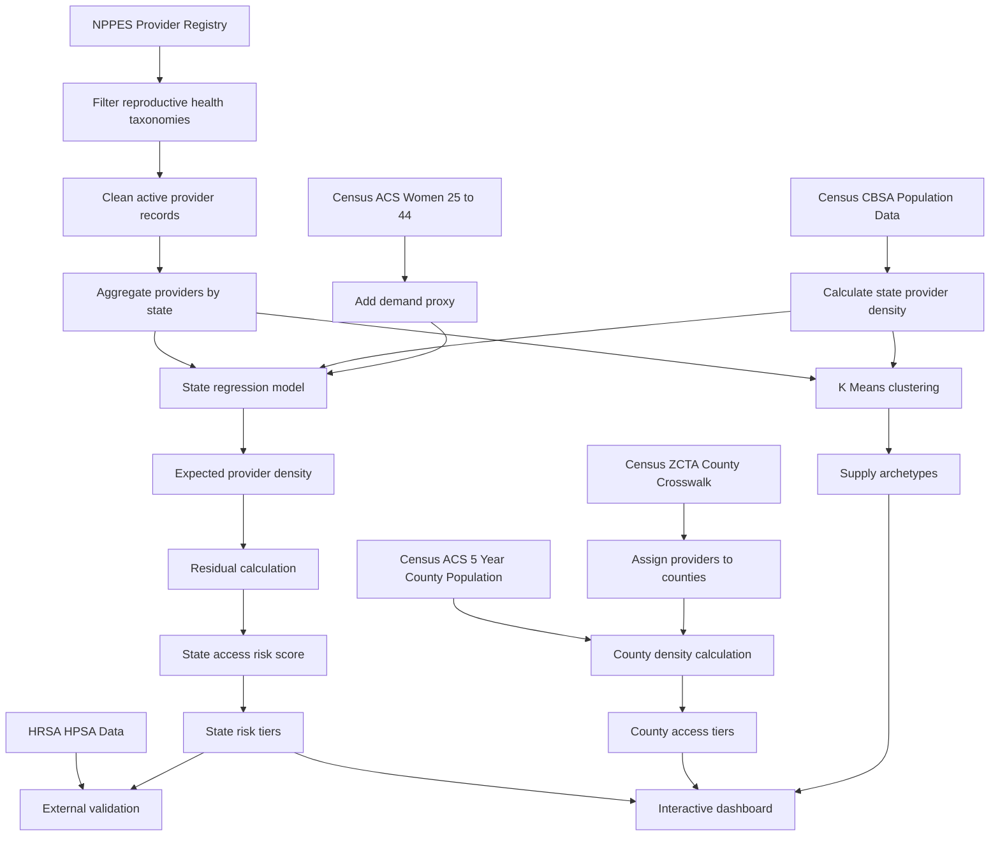

# Ovara Methodology Notes

**INST737: Data Science Techniques Final Project**  
University of Maryland, College of Information

## At a Glance

| Section | Purpose |
|---|---|
| Research Question | Explains what Ovara is trying to measure |
| Data Sources | Describes where the project data comes from |
| Methodology Flow | Shows the pipeline from raw data to risk classification |
| Regression Model | Explains how expected provider density is estimated |
| Access Risk Classification | Shows how states are grouped by access risk |
| HRSA External Validation | Checks Ovara against federal shortage designations |
| County Level Analysis | Drops the analysis from state level to county level for sharper geographic detail |
| K Means Clustering | Groups states into provider supply patterns |
| Limitations | Explains what the model cannot claim |
| Summary of Key Findings | Gives the main results and how to interpret them |

## Table of Contents

- [How to Read This File](#how-to-read-this-file)
- [What This Document Is](#what-this-document-is)
- [Methodology Flow](#methodology-flow)
- [The Research Question](#the-research-question)
- [Data Sources](#data-sources)
  - [CMS NPPES Registry](#cms-nppes-registry)
  - [Census CBSA and Population Estimates](#census-cbsa-and-population-estimates)
  - [Census ACS Demand Features](#census-acs-demand-features)
  - [Census ZCTA to County Crosswalk and ACS 5 Year County Population](#census-zcta-to-county-crosswalk-and-acs-5-year-county-population)
  - [HRSA HPSA Data](#hrsa-hpsa-data)
- [Regression Model](#regression-model)
  - [Features](#features)
  - [Results](#results)
  - [Why the Model Underperforms Out of Sample](#why-the-model-underperforms-out-of-sample)
  - [Why the Residuals Are Still Useful](#why-the-residuals-are-still-useful)
- [Access Risk Classification](#access-risk-classification)
- [HRSA External Validation](#hrsa-external-validation)
- [County Level Analysis](#county-level-analysis)
- [K Means Clustering](#k-means-clustering)
- [Limitations](#limitations)
- [Summary of Key Findings](#summary-of-key-findings)
- [Related Files](#related-files)

## How to Read This File

If you want a quick overview, start with the Research Question, Methodology Flow, and Summary of Key Findings. If you want to understand the modeling decisions, read the Regression Model and Access Risk Classification sections. If you want to evaluate whether the model is credible, focus on HRSA External Validation and Limitations. If you want to understand the full project context, read the whole file alongside the code.

## What This Document Is

This document explains the analytical choices I made while building Ovara, including the parts that did not work as cleanly as I expected. It is meant to be read alongside the code, not as a replacement for it. My goal is to be honest about what the model can and cannot tell us, while also explaining why I still think the output is useful despite its statistical limits.

> **Key takeaway:**  
> Ovara should not be treated as a perfect prediction model. It is better understood as a relative access signal that shows which states appear more underserved compared to similar states in the dataset.

## Methodology Flow



## The Research Question

The starting point for this project came from something I saw directly while working as a Healthcare Data Analyst for a management consulting company that operated Minimally Invasive Gynecologic Surgery focused Ambulatory Surgery Centers across major East Coast metro areas. The centers we worked with were consistently full, consistently referring patients out for specialty care, and consistently serving patients who traveled long distances to access care. That pattern raised a bigger question:

> **Is this just an operational issue for a few centers, or does it reflect something structural about how reproductive health providers are distributed across the country?**

The federal NPPES registry has registration data for every licensed healthcare provider in the United States. The data exists, but it sits in a raw file with 8 million rows and 330 columns, which makes it hard to turn into a clear geographic access picture. Ovara is my attempt to bridge that gap by taking raw workforce registry data and turning it into a signal about where supply may fall short of demand.

The core question is:

> **Given a state's population, workforce history, and specialty composition, how many reproductive health providers should we expect? And where does reality fall short of that expectation?**

## Data Sources

### CMS NPPES Registry

The National Plan and Provider Enumeration System is the main federal database of licensed healthcare providers. Ovara downloads the weekly NPI file and filters it to 13 NUCC taxonomy codes representing the reproductive and women's health workforce:

| Provider Group | Taxonomy Codes |
|---|---|
| OB/GYNs and subspecialties | `207V*` family |
| Certified Nurse Midwives | `367A00000X`, `176B00000X` |
| Women's Health Nurse Practitioners | `363LW0102X` |

The filtered dataset only includes active providers with a valid practice state and primary taxonomy code. Duplicate NPIs are removed. Date fields are parsed to compute provider tenure and identify recent growth based on providers registered within the last three years.

> **Important limitation:**  
> NPPES registration reflects who is licensed, not always who is currently practicing or accessible to patients.

Providers who have retired, moved, or stopped accepting patients may still appear in the registry. On the other side, providers working in states with heavier administrative processes may have registration delays. The model treats NPPES counts as a proxy for workforce supply. It is the best federal signal available for this scope, but it is still imperfect.

### Census CBSA and Population Estimates

Census Core Based Statistical Area delineation files map counties to metropolitan statistical areas. The 2024 population estimates from those CBSA files serve as the demand side denominator for all density calculations. Using metro population instead of total state population is intentional. Reproductive health providers are more likely to locate in metro areas, so using total state population would make rural heavy states look more underserved than they may be by this specific measure.

### Census ACS Demand Features

The Census American Community Survey B01001 table provides state level counts of women aged 25 to 44, which I use as the primary fertility age cohort. These counts are pulled through the Census API and cached locally. The point is to capture demand side variation that raw population does not. A state with a higher share of fertility age women should theoretically support more reproductive health providers, even if total population is the same.

### Census ZCTA to County Crosswalk and ACS 5 Year County Population

The county level analysis depends on two additional Census products. The ZCTA to county relationship file from the 2020 decennial release maps every ZIP code area, or ZCTA, to the county that contains its largest land area share. This is what lets the pipeline take an NPPES provider's ZIP code and assign it to the right county FIPS. The relationship file is downloaded once and cached at `data/reference_tables/zcta_county_crosswalk.csv`.

For county population, I use Census ACS 5 year table B01003 instead of ACS 1 year. ACS 1 year only publishes for counties with at least 65,000 residents, which would silently drop a large share of rural counties from the analysis. ACS 5 year covers all 3,144 US counties, including the small ones where access concerns are most likely to surface. The result is cached at `data/reference_tables/county_population.csv`.

### HRSA HPSA Data

The HRSA Health Professional Shortage Area Primary Care designations are fetched from the HRSA data warehouse and cached locally at:

```text
data/reference_tables/hrsa_hpsa_raw.csv
```

These designations represent areas where the federal government has already determined that primary care provider supply is insufficient relative to population. I use them as an external validation benchmark to check whether Ovara's statistical risk classification is picking up a similar shortage signal.

## Regression Model

### Features

The regression model estimates expected reproductive health provider density, measured as providers per 100,000 metro residents, from five features:

| Feature | Description | Why It Matters |
|---|---|---|
| `metro_population` | Aggregated CBSA metro population | Captures the size of the population being served |
| `taxonomy_diversity` | Mean number of unique taxonomy codes per ZIP area | Measures breadth of reproductive health specialty coverage |
| `recent_provider_growth` | Providers enumerated in the last three years | Captures recent workforce expansion |
| `avg_provider_enum_year` | Mean provider enrollment year | Acts as a workforce maturity proxy |
| `female_25_44_pop` | Women aged 25 to 44 from Census ACS | Acts as a demand proxy |

I chose these features to capture three main dimensions:

| Dimension | Features Used |
|---|---|
| Population scale | `metro_population`, `female_25_44_pop` |
| Specialty mix | `taxonomy_diversity` |
| Workforce maturity and growth | `recent_provider_growth`, `avg_provider_enum_year` |

### Results

| Metric | Value | Interpretation |
|---|---:|---|
| Training R² | 0.151 | The model explains about 15% of the variance in provider density |
| 5 fold cross validated R² | −0.226 | The model does not generalize well to held out states |
| Cross validation standard deviation | 0.34 | Fold results are unstable because the sample size is small |

A negative cross validated R² means that on held out data, the model performs worse than simply predicting the mean density for every state.

> **Key takeaway:**  
> The regression model is not strong enough to be used as a forecasting tool. Its value comes from the residuals, not from its ability to predict unseen states.

### Why the Model Underperforms Out of Sample

Several structural issues limit the regression's predictive power at this scale.

#### 1. The sample is too small for 5 fold cross validation

With 51 states including D.C., each fold uses roughly 40 training observations and 10 test observations. Five features in a linear regression with only 40 training samples is close to the edge of what is statistically stable. One unusual state in a test fold can move the fold R² from positive to strongly negative. The high standard deviation across folds, 0.34, shows that instability.

#### 2. Vermont and Wyoming are high leverage outliers

Vermont has a residual of +28.8, meaning 28 more providers per 100k than predicted. Wyoming has a residual of +67.1. Wyoming's outlier status is partly a data artifact because its CBSA metro population is only about 182,000, making the denominator very small. That makes the per 100k number extremely sensitive to even modest provider counts. When either state lands in a test fold, the fold's prediction error is dominated by that one observation.

#### 3. Feature collinearity inflates coefficient variance

`metro_population` and `female_25_44_pop` are both proxies for state size and are highly correlated. The standardized coefficients reflect this:

| Feature | Standardized Coefficient |
|---|---:|
| `metro_population` | −3.95 |
| `female_25_44_pop` | +2.51 |
| `recent_provider_growth` | −4.24 |

The large opposing coefficients on `metro_population` and `female_25_44_pop` are a sign of collinearity. The model is partly regressing the two population proxies against each other instead of learning a clean population to provider relationship.

#### 4. Structurally important features are missing

The strongest predictors of reproductive health provider presence are not in the NPPES data.

| Missing Feature | Why It Matters |
|---|---|
| Insurance coverage rates and Medicaid expansion status | Providers locate where they can maintain a financially viable practice |
| Abortion policy environment | Policy changes after Dobbs may affect OB/GYN workforce movement |
| Telehealth penetration | Physical provider density may miss virtual access |
| Rural healthcare infrastructure | Rural access depends on transportation, broadband, and clinic capacity |
| Medical school and residency program density | States with large academic medical centers may train and retain more providers |

Without these features, the model is trying to explain a structural access issue using mostly supply side workforce characteristics.

### Why the Residuals Are Still Useful

The negative cross validated R² does not mean the analysis has no value. The residuals are still meaningful because they answer a different question. The regression is not being used to forecast provider counts for unknown states. It is being used to create a relative comparison across states that already exist in the data.

The question is not:

> How many providers will Iowa have?

The question is:

> Given what Iowa looks like on the available supply and demand features, does it have more or fewer providers than expected?

That comparison still has value, even if the model would perform poorly on a truly held out state. The residuals capture deviation from the observed cross state pattern instead of absolute prediction accuracy.

> **Interpretation:**  
> This is a structure of shortage analysis, not a forecasting model. That distinction matters for how the outputs should be used.

## Access Risk Classification

Risk tiers are assigned by binning states into residual quartiles.

| Tier | Definition |
|---|---|
| `high_risk` | Bottom 25% of residuals, meaning most underserved relative to prediction |
| `moderate_risk` | Second residual quartile |
| `adequate` | Third residual quartile |
| `well_served` | Top residual quartile |

Each state also receives a continuous risk score from 0 to 100 based on residual percentile rank, where 100 is the most underserved state. This approach is intentionally relative, not absolute. There is no fixed threshold that defines what "enough" providers looks like. The classification tells us which states are most underserved *compared to other states with similar characteristics*, not whether any state has reached a universal adequacy benchmark.

> **Key takeaway:**  
> The risk tiers should be read as relative access signals, not clinical adequacy labels.

The 13 states classified as `high_risk` are:

| High Risk States |
|---|
| Arkansas |
| Delaware |
| District of Columbia |
| Indiana |
| Iowa |
| Kansas |
| Kentucky |
| Louisiana |
| Mississippi |
| New Hampshire |
| Oklahoma |
| Rhode Island |
| West Virginia |

## HRSA External Validation

To check whether the risk classification is picking up a real signal or just reflecting the model's limits, I benchmarked the `high_risk` tier against HRSA Primary Care HPSA designations. HRSA designations are useful here because they represent the federal government's own geographic shortage assessment.

### Validation Results

| Validation Metric | Value | Interpretation |
|---|---:|---|
| High risk states with active HRSA HPSA designations | 13 of 13 | Every high risk state has a federal shortage designation |
| Precision | 1.00 | No false positives in the high risk tier |
| Recall | 25.5% | Expected because Ovara only flags the bottom 25% of states |
| Spearman correlation with HRSA avg HPSA score | 0.21 | Directionally positive, but not statistically significant |
| p value | 0.15 | Not significant at this sample size |

All 13 states in Ovara's `high_risk` tier have active HRSA Primary Care HPSA designations, giving the model **precision = 1.0**. The recall is 25.5%, which is expected. HRSA designates shortage areas in almost every state, while Ovara only flags the bottom residual quartile, or 25% of states by design. Because of that setup, precision is the more useful metric here.

### HRSA Severity Gradient

The HRSA average HPSA score, based on a 0 to 25 severity scale, shows a positive tier gradient:

| Ovara Tier | HRSA Average HPSA Score |
|---|---:|
| `well_served` | 13.5 |
| `moderate_risk` | 14.4 |
| `high_risk` | 15.6 |

This is directionally consistent. Higher Ovara risk tiers are associated with higher HRSA assessed shortage severity. However, the correlation does not reach statistical significance with only 51 state level observations.

### Important Validation Caveat

Raw HRSA shortage population, meaning total residents in designated shortage areas, shows almost no correlation with Ovara's risk score at r = −0.03. This happens because raw shortage population is heavily influenced by state size. California and Texas can have large absolute shortage populations even when they are relatively well served on a per capita basis. Rate normalized metrics like the HRSA score work better as a validation benchmark, which matches Ovara's own use of rate based features over raw counts.

> **Validation takeaway:**  
> Ovara's `high_risk` states are real shortage states by independent federal assessment. The model is not just creating false positives.

## County Level Analysis

State level analysis is useful as a national overview, but it hides huge variation inside each state. A state classified as `adequate` at the aggregate level can still have dozens of counties where no reproductive health provider is registered at all. The county level analysis pushes the geographic resolution down one more step so those gaps become visible.

### Why I Use Density Thresholds Instead of Regression at the County Level

The county dataset has 3,144 rows but a problematic distribution: 1,038 counties, or 33%, have zero providers. That zero inflated distribution violates the assumptions of the linear regression I use at the state level, and trying to model it would either need a hurdle model or a zero inflated regression, both of which add complexity without telling a clearer story.

Instead, I use fixed density thresholds to assign each county to one of five tiers. The thresholds are chosen to call out clinically meaningful supply levels rather than relative ranking, which is how readers naturally think about provider access. One provider per 100,000 residents is bad regardless of where the rest of the country sits.

| Tier | Density per 100k | What It Means |
|---|---|---|
| Access Desert | 0.0 | No registered reproductive health providers |
| Critical | greater than 0 to 5.0 | Severe shortage relative to population |
| Underserved | greater than 5.0 to 10.0 | Below typical adequacy levels |
| Adequate | greater than 10.0 to 20.0 | Around the national median range |
| Well Served | over 20.0 | Strong provider supply |

Each county also gets a continuous risk score from 0 to 100 based on percentile rank and a national severity rank, both saved in the classified output.

### County Level Findings

| Tier | Counties | Population in Tier |
|---|---:|---:|
| Access Desert | 1,038 | 14,529,192 |
| Critical | 154 | 6,620,090 |
| Underserved | 314 | 11,329,729 |
| Adequate | 594 | 52,555,233 |
| Well Served | 1,044 | 246,063,349 |

The headline finding is that **1,038 counties, or 33% of all US counties, have zero registered reproductive health providers**, and roughly **14.5 million Americans live in these access deserts**. These are residents who have no local OB/GYN, no local certified nurse midwife, and no local women's health nurse practitioner registered in NPPES. They have to travel to a neighboring county for any reproductive health visit.

A further 154 counties are Critical, meaning under 5 providers per 100k, and 314 are Underserved, meaning 5 to 10 providers per 100k. Combined with the access deserts, that is **1,506 counties, or 48%, in some tier of concern**. The provider workforce concentration is severe: the 1,044 Well Served counties hold 246 million residents, or 74% of the population, while the 1,506 concern tier counties hold only 32 million residents, or 10% of the population, but represent half the geography.

### Why the County View Matters Even Though It Cannot Be Modeled the Same Way

The state level regression and the county level threshold analysis answer different questions. State residuals tell us, "given everything we know about a state, does it have more or fewer providers than expected?" County density tells us, "regardless of what the state looks like on average, does this specific county have a provider workforce or not?"

> **Key takeaway:**  
> The state level analysis is the comparative signal. The county level analysis is the absolute floor. Both views are needed because the gaps within a state can be just as large as the gaps between states.

## K Means Clustering

K Means clustering segments states into supply archetypes using four rate based features:

| Feature | Purpose |
|---|---|
| Provider density per 100k | Measures provider supply relative to population |
| Taxonomy diversity | Measures specialty breadth |
| Population normalized recent growth | Measures workforce expansion relative to population |
| Average enumeration year | Acts as a workforce maturity proxy |

Features are standardized with `StandardScaler` before clustering. The optimal cluster count was selected by a silhouette score sweep across k = 2 through k = 6:

| k | Silhouette Score |
|---|---:|
| 2 | **0.556** |
| 3 | 0.285 |
| 4 | 0.292 |
| 5 | 0.303 |
| 6 | 0.287 |

k = 2 was selected with a silhouette score of 0.556. The sharp drop from k = 2 to k = 3, from 0.556 to 0.285, is meaningful. It shows that the data separates most clearly into two supply archetypes:

| Cluster Pattern | Interpretation |
|---|---|
| Low supply states | States with weaker reproductive health provider supply signals |
| High supply states | States with stronger reproductive health provider supply signals |

The data does not naturally break into more detailed groups with the current feature set. Forcing k greater than or equal to 3 creates clusters that are less coherent internally.

> **Clustering takeaway:**  
> After normalization, the supply feature space shows a fairly simple low versus high split. A more detailed clustering model would require additional structural features.

## Limitations

### What the Model Cannot See

The NPPES registry reflects who is licensed, not who is accessible. A provider registered in Mississippi may be practicing mainly in Tennessee, retired, or on leave. The registry does not capture:

| Missing Access Factor | Why It Matters |
|---|---|
| Accepting new patients | Licensed providers may not have open appointment capacity |
| Medicaid acceptance | Provider supply does not equal access for low income patients |
| Access for uninsured patients | Insurance status can block practical access |
| Telemedicine reach | One provider in a metro area may serve rural patients |
| Clinic level capacity | One high volume provider is not the same as one low volume provider |

### Geographic Aggregation

The regression model is at the state level. State level aggregation hides major variation within states. Rural West Virginia and Charleston, WV have very different access realities even though both contribute to the same state residual. The state level model is useful as a first cut for national scope analysis, but it should not be used to make access claims about specific communities.

The county level threshold analysis was added to make some of that within state variation visible. It does not solve the problem fully because counties still aggregate cities, towns, and rural areas together, but it pushes the resolution one level closer to the communities being analyzed. The two views are complementary rather than substitutes.

### Connecticut Planning Region Mismatch

In 2022, the Census Bureau switched Connecticut from county based geography to nine Planning Regions. Connecticut is the only state where this happened so far. The county data uses the new Planning Region FIPS codes, 09110 through 09190, because I pull population from ACS 5 year 2022. The bundled Plotly county geojson, however, still has Connecticut's eight old county FIPS codes, such as 09001 Fairfield and 09003 Hartford. The two FIPS sets do not overlap, so the choropleth cannot draw Connecticut at all.

Compounding the issue, the ZCTA to county crosswalk is also from older Census files and uses the old county FIPS codes. NPPES providers in Connecticut ZIPs do not match anything in the new Planning Regions, so the underlying data shows all 9 Connecticut regions as access deserts. That is almost certainly wrong, since Connecticut has a normal density of OB/GYN providers in real life.

> **What this means for the analysis:**  
> Connecticut should be excluded mentally when reading the county map and the access desert count. The underlying state level analysis is unaffected because the state level pipeline does not depend on county FIPS. Fixing this requires a fresh county geojson from Census TIGER 2024 and a Planning Region patch in the ZCTA crosswalk.

### The 51 State Limit

Every statistical technique in this pipeline operates on 51 observations. That is a major constraint.

| Method | Constraint |
|---|---|
| Linear regression | Five features at n = 51 is underpowered for strong out of sample prediction |
| Cross validation | Each fold is too small to be stable |
| Silhouette score | Cluster quality is sensitive to individual state composition |
| Residual ranking | Outlier states can strongly affect interpretation |

These limitations are not really fixable within the current scope because they come from working at the state level with national data. The value comes from the patterns themselves, not from strong statistical confidence.

### Policy Environment

This analysis does not directly model the post Dobbs policy environment. Several states with restrictive abortion laws have reported signs of OB/GYN workforce pressure since 2022. The NPPES data reflects a current registration snapshot that may not fully capture provider relocation, reduced practice activity, or retirement driven by policy changes. States like Texas and Florida, classified as `adequate` or `well_served` in this analysis, may still be experiencing access deterioration that trailing NPPES data does not yet reflect.

### Ethical Considerations

This analysis flags states as underserved relative to a statistical model, not relative to a clinical standard of adequacy. The residuals do not tell us whether any state's provider supply is truly enough to meet patient need. They tell us which states are most underserved relative to the cross state pattern. A state ranked `well_served` by this model may still have communities with serious access gaps, especially rural communities and communities of color.

> **Ethical framing:**  
> The goal of this analysis is to show where federal workforce data points to structural supply gaps, so that people working in policy, advocacy, and resource allocation have a clearer picture to start from. It is a starting point, not a verdict.

## Summary of Key Findings

| Finding | Value | What It Means |
|---|---:|---|
| Training R² | 0.151 | The model captures some signal, but not enough for strong prediction |
| 5 fold CV R² | −0.226 | The model should not be used to forecast unseen states |
| CV MAE vs Baseline MAE | 8.86 vs 8.92 | Model performance is close to baseline |
| High risk states identified | 13 | Bottom quartile of residual based access risk |
| HRSA validation precision | 1.00 | Every high risk state also has federal shortage designations |
| HRSA avg HPSA score for well served states | 13.5 | Lower average federal shortage severity |
| HRSA avg HPSA score for high risk states | 15.6 | Higher average federal shortage severity |
| Optimal clustering k | 2 | States split most clearly into low supply and high supply groups |
| Outlier states | Vermont, Wyoming | These states strongly affect model stability |
| County access deserts | 1,038 | Counties with zero registered reproductive health providers |
| Population in access deserts | 14.5M | Residents living in counties with no local provider |
| Counties in concern tier | 1,506, or 48% | Sum of access desert, critical, and underserved counties |

The negative CV R² is the most important number in this table. It means the state level regression is not reliable as a prediction engine for unseen states. It also means the residuals should be interpreted as relative shortage signals within the observed dataset, not as forecasts. The 100% HRSA precision is the most validating number because it confirms that the states the model flags as most underserved are also states the federal shortage designation process has independently identified.

The county level numbers are the most striking part of this analysis. The 1,038 access desert counties and 14.5 million residents living in them are not statistical artifacts. They are the result of a direct count: zero providers in those counties of any of the 13 reproductive health taxonomies tracked. The state level residual analysis tells you which states are underserved relative to expectation. The county level desert count tells you that even within the states that look fine on average, large pockets of zero access exist on the ground.

## Related Files

| File | Purpose |
|---|---|
| [`README.md`](README.md) | Main project overview and setup instructions |
| [`main.py`](main.py) | Declares pipeline stages and hands them to `run_pipeline` |
| [`analysis/regression_model.py`](analysis/regression_model.py) | Builds the provider density regression model |
| [`analysis/access_risk_model.py`](analysis/access_risk_model.py) | Creates residual based state access risk tiers |
| [`analysis/build_zip_county_crosswalk.py`](analysis/build_zip_county_crosswalk.py) | Builds the ZIP code to county FIPS lookup |
| [`analysis/build_county_population.py`](analysis/build_county_population.py) | Pulls Census ACS 5 year county population reference |
| [`analysis/build_county_dataset.py`](analysis/build_county_dataset.py) | Builds the county level provider feature dataset |
| [`analysis/county_risk_classification.py`](analysis/county_risk_classification.py) | Assigns county density tiers and risk scores |
| [`analysis/hrsa_validation.py`](analysis/hrsa_validation.py) | Cross checks state risk tiers against HRSA HPSA designations |
| [`analysis/clustering_model.py`](analysis/clustering_model.py) | Runs K Means clustering |
| [`analysis/evaluate.py`](analysis/evaluate.py) | Evaluates model performance and validation outputs |
| [`etl/`](etl/) | Extract, transform, and one time NPPES preprocess scripts |
| [`vis/`](vis/) | Dashboard layout, callbacks, chart builders, and static exports |
| [`utils/`](utils/) | Shared helpers for io, caching, FIPS lookup, and pipeline staging |
| [`data/reference_tables/`](data/reference_tables/) | Cached reference data used in the project |

## Final Note

Ovara is not a final answer to reproductive healthcare access. It is a data pipeline that turns fragmented federal workforce records into a clearer access signal. The model has real limitations, especially around prediction, sample size, and missing structural features. But it still shows a useful pattern: some states have fewer reproductive health providers than expected, and the highest risk states line up with independent federal shortage designations. That makes the project useful as an early access intelligence tool, especially for identifying where deeper policy, clinical, and geographic analysis should happen next.

*Kenneth Yeaher INST737 Final Project University of Maryland, Spring 2026*