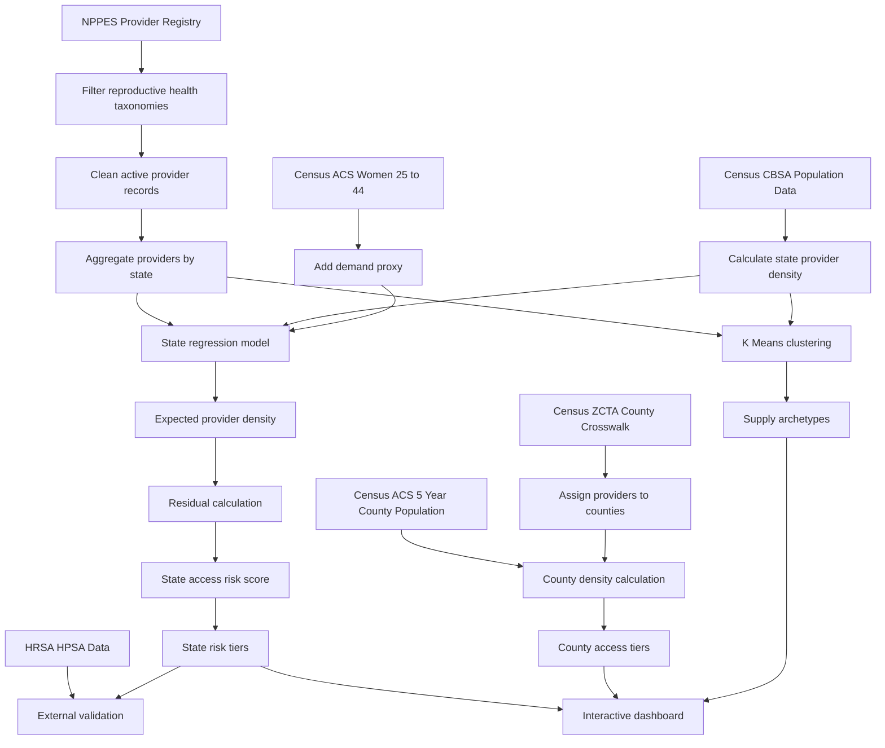

# Ovara Methodology Notes

**INST737: Data Science Techniques Final Project**  
University of Maryland, College of Information

## At a Glance

| Section | Purpose |
|---|---|
| Research Question | Explains what Ovara is trying to measure |
| Data Sources | Describes where the project data comes from |
| Methodology Flow | Shows the pipeline from raw data to risk classification |
| Regression Model | Explains how expected provider density is estimated |
| Access Risk Classification | Shows how states are grouped by access risk |
| HRSA External Validation | Checks Ovara against federal shortage designations |
| County Level Analysis | Drops the analysis from state level to county level for sharper geographic detail |
| K Means Clustering | Groups states into provider supply patterns |
| Limitations | Explains what the model cannot claim |
| Summary of Key Findings | Gives the main results and how to interpret them |

## Table of Contents

- [How to Read This File](#how-to-read-this-file)
- [What This Document Is](#what-this-document-is)
- [Methodology Flow](#methodology-flow)
- [The Research Question](#the-research-question)
- [Data Sources](#data-sources)
  - [CMS NPPES Registry](#cms-nppes-registry)
  - [Census CBSA and Population Estimates](#census-cbsa-and-population-estimates)
  - [Census ACS Demand Features](#census-acs-demand-features)
  - [Census ZCTA to County Crosswalk and ACS 5 Year County Population](#census-zcta-to-county-crosswalk-and-acs-5-year-county-population)
  - [HRSA HPSA Data](#hrsa-hpsa-data)
- [Regression Model](#regression-model)
  - [Features](#features)
  - [Results](#results)
  - [Why the Model Underperforms Out of Sample](#why-the-model-underperforms-out-of-sample)
  - [Why the Residuals Are Still Useful](#why-the-residuals-are-still-useful)
- [Access Risk Classification](#access-risk-classification)
- [HRSA External Validation](#hrsa-external-validation)
- [County Level Analysis](#county-level-analysis)
- [K Means Clustering](#k-means-clustering)
- [Limitations](#limitations)
- [Summary of Key Findings](#summary-of-key-findings)
- [Related Files](#related-files)

## How to Read This File

If you want a quick overview, start with the Research Question, Methodology Flow, and Summary of Key Findings. If you want to understand the modeling decisions, read the Regression Model and Access Risk Classification sections. If you want to evaluate whether the model is credible, focus on HRSA External Validation and Limitations. If you want to understand the full project context, read the whole file alongside the code.

## What This Document Is

This document explains the analytical choices I made while building Ovara, including the parts that did not work as cleanly as I expected. It is meant to be read alongside the code, not as a replacement for it. My goal is to be honest about what the model can and cannot tell us, while also explaining why I still think the output is useful despite its statistical limits.

> **Key takeaway:**  
> Ovara should not be treated as a perfect prediction model. It is better understood as a relative access signal that shows which states appear more underserved compared to similar states in the dataset.

## Methodology Flow


```mermaid
flowchart TD
    A[NPPES Provider Registry] --> B[Filter reproductive health taxonomies]
    B --> C[Clean active provider records]
    C --> D[Aggregate providers by state]

    E[Census CBSA Population Data] --> F[Calculate state provider density]
    G[Census ACS Women 25 to 44] --> H[Add demand proxy]

    D --> I[State regression model]
    F --> I
    H --> I

    I --> J[Expected provider density]
    J --> K[Residual calculation]
    K --> L[State access risk score]
    L --> M[State risk tiers]

    N[HRSA HPSA Data] --> O[External validation]
    M --> O

    P[Census ZCTA County Crosswalk] --> Q[Assign providers to counties]
    R[Census ACS 5 Year County Population] --> S[County density calculation]
    Q --> S
    S --> T[County access tiers]

    D --> U[K Means clustering]
    F --> U
    U --> V[Supply archetypes]

    M --> W[Interactive dashboard]
    T --> W
    V --> W
```

## The Research Question

The starting point for this project came from something I saw directly while working as a Healthcare Data Analyst for a management consulting company that operated Minimally Invasive Gynecologic Surgery focused Ambulatory Surgery Centers across major East Coast metro areas. The centers we worked with were consistently full, consistently referring patients out for specialty care, and consistently serving patients who traveled long distances to access care. That pattern raised a bigger question:

> **Is this just an operational issue for a few centers, or does it reflect something structural about how reproductive health providers are distributed across the country?**

The federal NPPES registry has registration data for every licensed healthcare provider in the United States. The data exists, but it sits in a raw file with 8 million rows and 330 columns, which makes it hard to turn into a clear geographic access picture. Ovara is my attempt to bridge that gap by taking raw workforce registry data and turning it into a signal about where supply may fall short of demand.

The core question is:

> **Given a state's population, workforce history, and specialty composition, how many reproductive health providers should we expect? And where does reality fall short of that expectation?**

## Data Sources

### CMS NPPES Registry

The National Plan and Provider Enumeration System is the main federal database of licensed healthcare providers. Ovara downloads the weekly NPI file and filters it to 13 NUCC taxonomy codes representing the reproductive and women's health workforce:

| Provider Group | Taxonomy Codes |
|---|---|
| OB/GYNs and subspecialties | `207V*` family |
| Certified Nurse Midwives | `367A00000X`, `176B00000X` |
| Women's Health Nurse Practitioners | `363LW0102X` |

The filtered dataset only includes active providers with a valid practice state and primary taxonomy code. Duplicate NPIs are removed. Date fields are parsed to compute provider tenure and identify recent growth based on providers registered within the last three years.

> **Important limitation:**  
> NPPES registration reflects who is licensed, not always who is currently practicing or accessible to patients.

Providers who have retired, moved, or stopped accepting patients may still appear in the registry. On the other side, providers working in states with heavier administrative processes may have registration delays. The model treats NPPES counts as a proxy for workforce supply. It is the best federal signal available for this scope, but it is still imperfect.

### Census CBSA and Population Estimates

Census Core Based Statistical Area delineation files map counties to metropolitan statistical areas. The 2024 population estimates from those CBSA files build the metro reference table at `data/load/cbsa_reference_dataset.csv`.

This table is **not** the density denominator, and an earlier version of the pipeline used it as one. It carries one row per county with the whole metro's population repeated on every row, so summing it by state counts each metro once per county it spans. The argument for using metro rather than state population, that providers cluster in metro areas, was reasonable in principle. The implementation was not: it did not compute metro population, it computed a county weighted sum of it.

Both the state and county density denominators now come from ACS 5 year county population summed to the level being measured, so the two layers share one denominator source and one Census vintage.

### Census ACS Demand Features

The Census American Community Survey B01001 table provides state level counts of women aged 25 to 44, which I use as the primary fertility age cohort. These counts are pulled through the Census API and cached locally. The point is to capture demand side variation that raw population does not. A state with a higher share of fertility age women should theoretically support more reproductive health providers, even if total population is the same.

### Census ZCTA to County Crosswalk and ACS 5 Year County Population

The county level analysis depends on two additional Census products. The ZCTA to county relationship file from the 2020 decennial release maps every ZIP code area, or ZCTA, to the county that contains its largest land area share. This is what lets the pipeline take an NPPES provider's ZIP code and assign it to the right county FIPS. The relationship file is downloaded once and cached at `data/reference_tables/zcta_county_crosswalk.csv`.

For county population, I use Census ACS 5 year table B01003 instead of ACS 1 year. ACS 1 year only publishes for counties with at least 65,000 residents, which would silently drop a large share of rural counties from the analysis. ACS 5 year covers all 3,144 US counties, including the small ones where access concerns are most likely to surface. The result is cached at `data/reference_tables/county_population.csv`.

### HRSA HPSA Data

The HRSA Health Professional Shortage Area Primary Care designations are fetched from the HRSA data warehouse and cached locally at:

```text
data/reference_tables/hrsa_hpsa_raw.csv
```

These designations represent areas where the federal government has already determined that primary care provider supply is insufficient relative to population. I use them as an external validation benchmark to check whether Ovara's statistical risk classification is picking up a similar shortage signal.

## Regression Model

### Features

The regression model estimates expected reproductive health provider density, measured as providers per 100,000 state residents, from two features:

| Feature | Description | Why It Matters |
|---|---|---|
| `taxonomy_diversity` | Mean number of unique taxonomy codes per ZIP area | Measures breadth of reproductive health specialty coverage |
| `growth_per_100k` | Providers enumerated in the last three years, per 100,000 residents | Measures workforce expansion relative to population |

I did not choose these features by judgement. An earlier version used five: `metro_population`, `taxonomy_diversity`, `recent_provider_growth`, `avg_provider_enum_year` and `female_25_44_pop`. That set mixed counts with rates against a rate target, and it carried two collinear population proxies whose coefficients came out with opposite signs, which is two variables cancelling rather than two variables explaining.

`analysis/evaluate.py` now fits three candidate sets on one shared split, `KFold(5, shuffle=True, random_state=42)`, and saves the result to `data/model_outputs/feature_selection.json`. Against a mean baseline MAE of 6.03:

| Feature set | Features | CV R² | CV MAE | CV R² std |
|---|---:|---:|---:|---:|
| `shipped_five` | 5 | +0.1140 | 5.0977 | 0.4319 |
| `four_rates` | 4 | +0.2292 | 4.8801 | 0.3456 |
| `two_rates` | 2 | **+0.3253** | **4.4821** | **0.2467** |

Fewer features win, and they win on stability as well as on R². On 51 rows every feature added costs more in coefficient variance than it returns in explanatory power. Dropping the raw population terms also removed the collinearity: both surviving coefficients are positive.

The two dropped rate features, `pct_female_25_44` and `provider_enum_year_centered`, are still built by the pipeline and still available. They are simply not in the winning set.

### Results

| Metric | Value | Interpretation |
|---|---:|---|
| Training R² | 0.4375 | The model explains about 44% of the variance in provider density in sample |
| 5 fold cross validated R² | +0.3253 | The model does generalize to held out states, modestly |
| Cross validation standard deviation | 0.2467 | Fold results still vary because the sample size is small |
| 5 fold cross validated MAE | 4.4821 | Average error of about 4.5 providers per 100k |
| Mean baseline MAE | 6.03 | Predicting the mean for every state |
| Intercept | -6.688 | Interpretable now that the enumeration year is centered |

An earlier version of this document reported a cross validated R² of −0.226 and built an argument around it. That number was real, but it was measuring a broken model. The denominator was wrong, so the target itself was wrong, and the feature set had not been tested against alternatives. Both are fixed, and the corrected model beats the mean baseline on held out folds: R² +0.3253, MAE 4.4821 against a baseline of 6.03, a 26% error reduction.

> **Key takeaway:**  
> The regression is now modestly predictive rather than worse than useless, but with 51 rows and a fold standard deviation of 0.2467 it is still not a forecasting tool. Its value is in the residuals.

### What Still Limits the Model

The corrected model generalizes, but only modestly. Several structural issues remain.

#### 1. The sample is small for 5 fold cross validation

With 51 states including D.C., each fold uses roughly 40 training observations and 10 test observations. One unusual state in a test fold still moves that fold's R² a long way. The standard deviation across folds, 0.2467, shows the remaining instability. This is also why the two feature model beat the five feature one: at this sample size each additional feature costs more in coefficient variance than it returns.

#### 2. A few states are high leverage outliers

Four states sit more than two residual standard deviations from the fit: Alaska, District of Columbia, Maryland, Vermont. D.C. is +23.75 and Vermont +19.90 above prediction; Maryland is −15.94 below it. D.C. is a single dense city treated as a state, so its density is not comparable to the others.

Wyoming is no longer an outlier. Under the old denominator its residual was +67.1, almost entirely because its CBSA metro population came to about 182,000 against a real population of 577,929. That was arithmetic, not access.

#### 3. Collinearity has been removed, not managed

The old five feature set carried `metro_population` and `female_25_44_pop`, two proxies for the same thing, correlated at r = 0.89 with VIFs of 6.1 and 5.0. Their standardized coefficients came out with opposite signs, which is two collinear variables cancelling. The current set avoids the problem rather than correcting for it:

| Feature | Standardized Coefficient |
|---|---:|
| `taxonomy_diversity` | +3.761 |
| `growth_per_100k` | +2.7918 |

Both are positive, and both point the way the domain says they should: states with broader specialty coverage and faster recent growth have higher provider density.

#### 4. Structurally important features are missing

The strongest predictors of reproductive health provider presence are not in the NPPES data.

| Missing Feature | Why It Matters |
|---|---|
| Insurance coverage rates and Medicaid expansion status | Providers locate where they can maintain a financially viable practice |
| Abortion policy environment | Policy changes after Dobbs may affect OB/GYN workforce movement |
| Telehealth penetration | Physical provider density may miss virtual access |
| Rural healthcare infrastructure | Rural access depends on transportation, broadband, and clinic capacity |
| Medical school and residency program density | States with large academic medical centers may train and retain more providers |

Without these features, the model is trying to explain a structural access issue using mostly supply side workforce characteristics.

### Why the Residuals Are Still Useful

A cross validated R² of about 0.33 is modest, and the residuals matter more than the prediction. The regression is not being used to forecast provider counts for unknown states. It is being used to create a relative comparison across states that already exist in the data.

The residuals that feed the risk tiers are scored **out of fold**. With 51 rows an in sample fit partly interpolates, so each state's own influence on the coefficients would otherwise leak into its own residual. Moving to `cross_val_predict` on the same split changed the tier of ten states: Alabama and Georgia moved out of `high_risk`, Indiana and Tennessee moved into it, and Michigan, Washington, New Jersey, North Dakota, Rhode Island and Missouri each shifted by one tier.

The question is not:

> How many providers will Iowa have?

The question is:

> Given what Iowa looks like on the available supply and demand features, does it have more or fewer providers than expected?

That comparison still has value, even if the model would perform poorly on a truly held out state. The residuals capture deviation from the observed cross state pattern instead of absolute prediction accuracy.

> **Interpretation:**  
> This is a structure of shortage analysis, not a forecasting model. That distinction matters for how the outputs should be used.

## Access Risk Classification

Risk tiers are assigned by binning states into residual quartiles.

| Tier | Definition |
|---|---|
| `high_risk` | Bottom 25% of residuals, meaning most underserved relative to prediction |
| `moderate_risk` | Second residual quartile |
| `adequate` | Third residual quartile |
| `well_served` | Top residual quartile |

Each state also receives a continuous risk score from 0 to 100 based on residual percentile rank, where 100 is the most underserved state. This approach is intentionally relative, not absolute. There is no fixed threshold that defines what "enough" providers looks like. The classification tells us which states are most underserved *compared to other states with similar characteristics*, not whether any state has reached a universal adequacy benchmark.

> **Key takeaway:**  
> The risk tiers should be read as relative access signals, not clinical adequacy labels.

The 13 states classified as `high_risk` are:

| High Risk States |
|---|
| Arkansas |
| Delaware |
| District of Columbia |
| Indiana |
| Iowa |
| Kansas |
| Kentucky |
| Louisiana |
| Mississippi |
| New Hampshire |
| Oklahoma |
| Rhode Island |
| West Virginia |

## HRSA External Validation

To check whether the risk classification is picking up a real signal or just reflecting the model's limits, I benchmarked the `high_risk` tier against HRSA Primary Care HPSA designations. HRSA designations are useful here because they represent the federal government's own geographic shortage assessment.

### Validation Results

The validation asks whether states Ovara scores as higher risk carry more federal shortage burden. It is measured as Spearman rank correlation between the continuous risk score and each HRSA burden measure, expressed per 100,000 residents so a large state does not dominate by being large.

| HRSA burden measure, per 100k | Spearman rho | p | rho before normalizing |
|---|---:|---:|---:|
| Shortage population | +0.0953 | 0.5059 | +0.4108 |
| FTE shortage | +0.2400 | 0.0898 | +0.4410 |
| Designated area count | -0.2947 | 0.0358 | +0.3079 |
| Average HPSA score, a 0 to 25 scale that needs no normalization | +0.1814 | 0.2026 | not applicable |

**On a size neutral basis the model does not show meaningful agreement with HRSA shortage burden.** Shortage population reaches only +0.10 and is not significant. FTE shortage is the strongest signal at +0.24, and it does not reach significance at n = 51. Designated area count runs the wrong way at −0.29, meaning states Ovara scores as higher risk have slightly fewer HPSA designations per resident.

The last column is the same correlation computed before dividing by population, and the gap between the two columns is the real finding. Un normalized, shortage population correlates at +0.41 and FTE shortage at +0.44, both comfortably significant. Almost all of that is state size: large states have both large HRSA shortage totals and, after the denominator fix, higher risk scores. Normalizing per resident removes it. Both figures are kept in `hrsa_validation_metadata.json`, the un normalized one under `size_confounded_rho`, so the difference stays visible rather than being reported at whichever scale looks better.

### What Replaced the Confusion Matrix

This section used to report precision, recall, F1 and an agreement rate against whether a state had any active Primary Care HPSA designation. The saved confusion matrix was tp 13, fp 0, fn 38, tn 0.

There are no true negatives in that matrix because **every state has at least one designated Primary Care HPSA**. The ground truth label is positive for all 51 rows. With a constant label, any classifier that predicts positive at all scores a precision of 1.00, so the reported precision measured nothing. I originally read it as validation. It was an artefact. Those metrics have been deleted rather than reinterpreted.

### HRSA Severity Gradient

The HRSA average HPSA score, on a 0 to 25 severity scale, still shows a weak tier gradient:

| Ovara Tier | HRSA Average HPSA Score |
|---|---:|
| `well_served` | 13.99 |
| `adequate` | 14.7 |
| `high_risk` | 14.9 |
| `moderate_risk` | 15.51 |

The gradient is not monotonic. `moderate_risk` sits above `high_risk`, and the underlying correlation is +0.1814 at p = 0.2026. This is not evidence for the tiers.

### A Note on the Measure Itself

HRSA designation populations overlap within a state, so `hrsa_shortage_pop` sums to more than the resident population in many states. D.C. totals 12,073,756 against 670,587 residents, roughly 18 times its population. Per 100k it is a designation intensity index rather than a share of residents, which makes it the weakest of the three burden measures and, unsurprisingly, the one with the weakest correlation.

> **Validation takeaway:**  
> The external validation does not currently support the risk tiers. It does not refute them either, since HRSA Primary Care designations measure a broader workforce than reproductive health specifically. What it does rule out is the earlier claim of precision 1.00, which was an artefact of a constant label.

## County Level Analysis

State level analysis is useful as a national overview, but it hides huge variation inside each state. A state classified as `adequate` at the aggregate level can still have dozens of counties where no reproductive health provider is registered at all. The county level analysis pushes the geographic resolution down one more step so those gaps become visible.

### Why I Use Density Thresholds Instead of Regression at the County Level

The county dataset has 3,144 rows but a problematic distribution: 1,029 counties, or 33%, have zero providers. That zero inflated distribution violates the assumptions of the linear regression I use at the state level, and trying to model it would either need a hurdle model or a zero inflated regression, both of which add complexity without telling a clearer story.

Instead, I use fixed density thresholds to assign each county to one of five tiers. The thresholds are chosen to call out clinically meaningful supply levels rather than relative ranking, which is how readers naturally think about provider access. One provider per 100,000 residents is bad regardless of where the rest of the country sits.

| Tier | Density per 100k | What It Means |
|---|---|---|
| Access Desert | 0.0 | No registered reproductive health providers |
| Critical | greater than 0 to 5.0 | Severe shortage relative to population |
| Underserved | greater than 5.0 to 10.0 | Below typical adequacy levels |
| Adequate | greater than 10.0 to 20.0 | Around the national median range |
| Well Served | over 20.0 | Strong provider supply |

Each county also gets a continuous risk score from 0 to 100 based on percentile rank and a national severity rank, both saved in the classified output.

### County Level Findings

| Tier | Counties | Population in Tier |
|---|---:|---:|
| Access Desert | 1,029 | 10,917,875 |
| Critical | 154 | 6,620,090 |
| Underserved | 314 | 11,329,729 |
| Adequate | 597 | 52,938,860 |
| Well Served | 1,050 | 249,291,039 |

> **Corrected August 2026.** An earlier version of this table reported 1,038 access deserts holding
> 14,529,192 residents. All nine Connecticut planning regions were in that count with zero providers
> each, because the ZIP to county crosswalk and the county population table came from Census
> vintages that use different Connecticut county codes. Connecticut has 1,275 providers in the
> county layer and none of its nine regions is an access desert. See the Known Limitations section
> of the README.

The headline finding is that **1,029 counties, or 33% of all US counties, have zero registered reproductive health providers**, and roughly **10.9 million Americans live in these access deserts**. These are residents who have no local OB/GYN, no local certified nurse midwife, and no local women's health nurse practitioner registered in NPPES. They have to travel to a neighboring county for any reproductive health visit.

A further 154 counties are Critical, meaning under 5 providers per 100k, and 314 are Underserved, meaning 5 to 10 providers per 100k. Combined with the access deserts, that is **1,497 counties, or 48%, in some tier of concern**. The provider workforce concentration is severe: the 1,050 Well Served counties hold 249 million residents, or 75% of the population, while the 1,497 concern tier counties hold only 29 million residents, or 9% of the population, but represent almost half the geography.

### Why the County View Matters Even Though It Cannot Be Modeled the Same Way

The state level regression and the county level threshold analysis answer different questions. State residuals tell us, "given everything we know about a state, does it have more or fewer providers than expected?" County density tells us, "regardless of what the state looks like on average, does this specific county have a provider workforce or not?"

> **Key takeaway:**  
> The state level analysis is the comparative signal. The county level analysis is the absolute floor. Both views are needed because the gaps within a state can be just as large as the gaps between states.

## K Means Clustering

K Means clustering segments states into supply archetypes using four rate based features:

| Feature | Purpose |
|---|---|
| Provider density per 100k | Measures provider supply relative to population |
| Taxonomy diversity | Measures specialty breadth |
| Population normalized recent growth | Measures workforce expansion relative to population |
| Average enumeration year | Acts as a workforce maturity proxy |

Features are standardized with `StandardScaler` before clustering. The cluster count is selected by a silhouette sweep across k = 2 through k = 6, with a size guard: any k whose smallest cluster holds fewer than five states is rejected, because a cluster that small is a set of outliers rather than a supply archetype.

| k | Silhouette Score | Cluster sizes | Outcome |
|---|---:|---|---|
| 2 | 0.2642 | [18, 33] | **selected** |
| 3 | 0.2487 | [5, 20, 26] | runner up |
| 4 | 0.2808 | [4, 12, 15, 20] | rejected, smallest cluster under 5 |
| 5 | 0.248 | [4, 9, 12, 12, 14] | rejected, smallest cluster under 5 |
| 6 | 0.2842 | [4, 8, 8, 9, 10, 12] | rejected, smallest cluster under 5 |

k = 2 is selected at 0.2642, splitting 33 states against 18. The guard matters here: k = 6 and k = 4 carry the two highest silhouette scores and both isolate a four state cluster.

Under the old denominator this sweep chose k = 2 with a silhouette of 0.556 and split 47 states against 4, and I read the sharp drop from k = 2 to k = 3 as evidence of a clean two archetype structure. It was not. Those four states were the ones whose denominators were most inflated, so the split was separating an arithmetic error from the rest of the country. With the denominator corrected the silhouette scores are far flatter, between 0.248 and 0.284 across the whole range, which is the more honest picture: the feature space does not separate cleanly at any k.

| Cluster Pattern | States | Interpretation |
|---|---:|---|
| Low supply states | 33 | Weaker reproductive health provider supply signals |
| High supply states | 18 | Stronger reproductive health provider supply signals |

> **Clustering takeaway:**  
> The silhouette scores are low and close together at every k, so the two cluster split is the least bad option rather than a structure the data insists on. A more detailed clustering model would require additional structural features.

## Limitations

### What the Model Cannot See

The NPPES registry reflects who is licensed, not who is accessible. A provider registered in Mississippi may be practicing mainly in Tennessee, retired, or on leave. The registry does not capture:

| Missing Access Factor | Why It Matters |
|---|---|
| Accepting new patients | Licensed providers may not have open appointment capacity |
| Medicaid acceptance | Provider supply does not equal access for low income patients |
| Access for uninsured patients | Insurance status can block practical access |
| Telemedicine reach | One provider in a metro area may serve rural patients |
| Clinic level capacity | One high volume provider is not the same as one low volume provider |

### Geographic Aggregation

The regression model is at the state level. State level aggregation hides major variation within states. Rural West Virginia and Charleston, WV have very different access realities even though both contribute to the same state residual. The state level model is useful as a first cut for national scope analysis, but it should not be used to make access claims about specific communities.

The county level threshold analysis was added to make some of that within state variation visible. It does not solve the problem fully because counties still aggregate cities, towns, and rural areas together, but it pushes the resolution one level closer to the communities being analyzed. The two views are complementary rather than substitutes.

### Connecticut Planning Regions, Now Resolved

In 2022 the Census Bureau replaced Connecticut's eight counties with nine Planning Regions as the county equivalent. Connecticut is so far the only state where this has happened, and it broke the county layer in two places at once.

County population came from ACS 5 year 2022, so it held the new codes 09110 through 09190. The ZCTA to county crosswalk came from the 2020 relationship file, so it emitted the old codes 09001 through 09015. The two sets share no codes, so the population join dropped all 1,275 matched Connecticut providers and published the nine Planning Regions as access deserts with zero providers each. The county geojson was also on the old vintage, so the map could not draw the state at all.

All three are fixed. Connecticut ZIPs are routed to Planning Regions through a crosswalk vendored from CTData Collaborative, the geojson is rebuilt from the Census 2023 cartographic boundary file, and `analysis/build_county_dataset.py` now raises if any state's crosswalk geography and population geography are disjoint. Connecticut carries 1,275 providers across nine regions, six Well Served and three Adequate, and none of them is an access desert. Correcting this moved the national access desert count from 1,038 to 1,029 and the population in them from 14,529,192 to 10,917,875.

> **What remains approximate:**  
> The CTData assignment is a centroid nearest neighbour spatial join against 2022 Census boundaries, so a ZIP straddling a regional boundary is assigned whole to the region containing its centroid. A further 89 Connecticut providers fail the ZIP lookup outright, the same way providers in every other state do when their practice ZIP has no ZCTA match.

### The 51 State Limit

Every statistical technique in this pipeline operates on 51 observations. That is a major constraint.

| Method | Constraint |
|---|---|
| Linear regression | Five features at n = 51 is underpowered for strong out of sample prediction |
| Cross validation | Each fold is too small to be stable |
| Silhouette score | Cluster quality is sensitive to individual state composition |
| Residual ranking | Outlier states can strongly affect interpretation |

These limitations are not really fixable within the current scope because they come from working at the state level with national data. The value comes from the patterns themselves, not from strong statistical confidence.

### Policy Environment

This analysis does not directly model the post Dobbs policy environment. Several states with restrictive abortion laws have reported signs of OB/GYN workforce pressure since 2022. The NPPES data reflects a current registration snapshot that may not fully capture provider relocation, reduced practice activity, or retirement driven by policy changes. States like Texas and Florida, classified as `adequate` or `well_served` in this analysis, may still be experiencing access deterioration that trailing NPPES data does not yet reflect.

### Ethical Considerations

This analysis flags states as underserved relative to a statistical model, not relative to a clinical standard of adequacy. The residuals do not tell us whether any state's provider supply is truly enough to meet patient need. They tell us which states are most underserved relative to the cross state pattern. A state ranked `well_served` by this model may still have communities with serious access gaps, especially rural communities and communities of color.

> **Ethical framing:**  
> The goal of this analysis is to show where federal workforce data points to structural supply gaps, so that people working in policy, advocacy, and resource allocation have a clearer picture to start from. It is a starting point, not a verdict.

## Summary of Key Findings

| Finding | Value | What It Means |
|---|---:|---|
| National provider density | 30.06 per 100k | Was 4.55 under the broken denominator |
| Training R² | 0.4375 | The model captures real signal in sample |
| 5 fold CV R² | +0.3253 +/- 0.2467 | Modestly predictive on held out states, was −0.226 |
| CV MAE vs baseline MAE | 4.4821 vs 6.03 | A 26% error reduction over predicting the mean |
| Selected feature set | 2 features | Chosen by cross validated R², beat 4 and 5 feature sets |
| Intercept | -6.688 | Interpretable now the enumeration year is centered |
| High risk states identified | 13 | Bottom quartile of residual based access risk |
| Residuals scored | out of fold | `cross_val_predict`, which moved 10 states between tiers |
| Outlier states | Alaska, District of Columbia, Maryland, Vermont | Beyond two residual standard deviations |
| HRSA shortage population per 100k | +0.0953, p = 0.5059 | No meaningful agreement once size is removed |
| HRSA FTE shortage per 100k | +0.2400, p = 0.0898 | The strongest external signal, still not significant |
| HRSA designated areas per 100k | -0.2947, p = 0.0358 | Runs against the model's ranking |
| Optimal clustering k | 2 | 33 low supply states against 18 high supply, silhouette 0.2642 |
| County access deserts | 1,029 | Counties with zero registered reproductive health providers |
| Population in access deserts | 10.9M | Residents living in counties with no local provider |
| Counties in concern tier | 1,497, or 48% | Sum of access desert, critical, and underserved counties |

**The state level numbers in this table are not the ones this project originally published, and the difference was a bug rather than a revision.** `build_population_proxy` divided state provider counts by a sum of CBSA metro populations. That table holds one row per county carrying the whole metro's population, so the 29 county Atlanta MSA contributed its 6,411,149 residents 29 times. Georgia's denominator reached 198,940,717 against a true 10,722,325 and the 51 states summed to 2.19 billion. The inflation ran 0.32x to 28.8x, so it did not scale the ranking, it scrambled it: Spearman between the published `providers_per_100k` and a correct one was 0.17 at p = 0.23. The thinnest states were reported as New Jersey, Virginia, Georgia and Indiana. They are actually Arkansas, Alabama, North Dakota, Mississippi, Nevada and Iowa, which is the ordering published maternity care desert research finds. The county layer was never affected, because county density always divided by ACS county population.

An earlier version of this document argued at length from a cross validated R² of −0.226. That argument was sound about the model it described and wrong about the world, because the target it was fitted against was arithmetic rather than provider density. The corrected model reaches +0.3253 and beats the mean baseline, though with 51 rows and a fold standard deviation of 0.2467 it remains a structure of shortage analysis rather than a forecasting tool.

The 100% HRSA precision was never a validating number, and I originally read it as one. Every state has at least one active Primary Care shortage designation, so the benchmark label is positive for all 51 rows; with a constant label there are no true negatives, and any classifier that predicts positive scores 1.00. It has been replaced by rank correlation against continuous HRSA burden per 100,000 residents, and that correlation does not currently support the tiers: +0.10 for shortage population, +0.24 for FTE shortage, and −0.29 for designated area count. Before normalizing for population the first two look convincing, at +0.41 and +0.44, which is exactly why they are reported per resident.

The county level numbers are the most striking part of this analysis, and they are also where I found my other bad error. An earlier version of this document said the access desert count contained no statistical artifacts. That was wrong. A quarter of the reported population, 3.6 million people across Connecticut's nine planning regions, was a join failure between two Census vintages rather than a real absence of providers. After the correction the count rests on a direct count of registered providers in the 13 reproductive health taxonomies tracked, and the remaining caveat is coverage, not arithmetic: NPPES records where a provider bills, not whether a patient can get an appointment.

## Related Files

| File | Purpose |
|---|---|
| [`README.md`](README.md) | Main project overview and setup instructions |
| [`main.py`](main.py) | Declares pipeline stages and hands them to `run_pipeline` |
| [`analysis/regression_model.py`](analysis/regression_model.py) | Builds the provider density regression model |
| [`analysis/access_risk_model.py`](analysis/access_risk_model.py) | Creates residual based state access risk tiers |
| [`analysis/build_zip_county_crosswalk.py`](analysis/build_zip_county_crosswalk.py) | Builds the ZIP code to county FIPS lookup |
| [`analysis/build_county_population.py`](analysis/build_county_population.py) | Pulls Census ACS 5 year county population reference |
| [`analysis/build_county_dataset.py`](analysis/build_county_dataset.py) | Builds the county level provider feature dataset |
| [`analysis/county_risk_classification.py`](analysis/county_risk_classification.py) | Assigns county density tiers and risk scores |
| [`analysis/hrsa_validation.py`](analysis/hrsa_validation.py) | Cross checks state risk tiers against HRSA HPSA designations |
| [`analysis/clustering_model.py`](analysis/clustering_model.py) | Runs K Means clustering |
| [`analysis/evaluate.py`](analysis/evaluate.py) | Evaluates model performance and validation outputs |
| [`etl/`](etl/) | Extract, transform, and one time NPPES preprocess scripts |
| [`vis/`](vis/) | Dashboard layout, callbacks, chart builders, and static exports |
| [`utils/`](utils/) | Shared helpers for io, caching, FIPS lookup, and pipeline staging |
| [`data/reference_tables/`](data/reference_tables/) | Cached reference data used in the project |

## Final Note

Ovara is not a final answer to reproductive healthcare access. It is a data pipeline that turns fragmented federal workforce records into a clearer access signal. The model has real limitations, especially around prediction, sample size, and missing structural features. But it still shows a useful pattern: some states have fewer reproductive health providers than expected, and the highest risk states line up with independent federal shortage designations. That makes the project useful as an early access intelligence tool, especially for identifying where deeper policy, clinical, and geographic analysis should happen next.

*Kenneth Yeaher INST737 Final Project University of Maryland, Spring 2026*