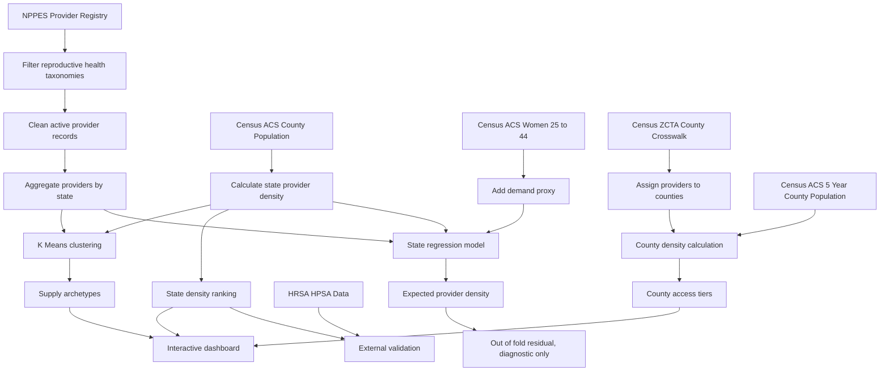

# Ovara Methodology Notes

**INST737: Data Science Techniques Final Project**  
University of Maryland, College of Information

## At a Glance

| Section | Purpose |
|---|---|
| Research Question | Explains what Ovara is trying to measure |
| Data Sources | Describes where the project data comes from |
| Methodology Flow | Shows the pipeline from raw data to risk classification |
| Regression Model | Documents the state level negative result and the feature leak behind it |
| HRSA External Validation | Checks Ovara against federal shortage designations |
| County Level Analysis | Drops the analysis from state level to county level for sharper geographic detail |
| K Means Clustering | Groups states into provider supply patterns |
| Limitations | Explains what the model cannot claim |
| Summary of Key Findings | Gives the main results and how to interpret them |

## Table of Contents

- [How to Read This File](#how-to-read-this-file)
- [What This Document Is](#what-this-document-is)
- [Methodology Flow](#methodology-flow)
- [The Research Question](#the-research-question)
- [Data Sources](#data-sources)
  - [CMS NPPES Registry](#cms-nppes-registry)
  - [Census CBSA and Population Estimates](#census-cbsa-and-population-estimates)
  - [Census ACS Demand Features](#census-acs-demand-features)
  - [Census ZCTA to County Crosswalk and ACS 5 Year County Population](#census-zcta-to-county-crosswalk-and-acs-5-year-county-population)
  - [HRSA HPSA Data](#hrsa-hpsa-data)
- [Regression Model](#regression-model)
  - [Features](#features)
  - [Results](#results)
  - [Why the Model Underperforms Out of Sample](#why-the-model-underperforms-out-of-sample)
  - [Why the Residuals Are Still Useful](#why-the-residuals-are-still-useful)
- [HRSA External Validation](#hrsa-external-validation)
- [County Level Analysis](#county-level-analysis)
- [K Means Clustering](#k-means-clustering)
- [Limitations](#limitations)
- [Summary of Key Findings](#summary-of-key-findings)
- [Related Files](#related-files)

## How to Read This File

If you want a quick overview, start with the Research Question, Methodology Flow, and Summary of Key Findings. If you want to understand the modeling decisions, and why the state model is reported as a failure, read the Regression Model section. If you want to evaluate whether the model is credible, focus on HRSA External Validation and Limitations. If you want to understand the full project context, read the whole file alongside the code.

## What This Document Is

This document explains the analytical choices I made while building Ovara, including the parts that did not work as cleanly as I expected. It is meant to be read alongside the code, not as a replacement for it. My goal is to be honest about what the model can and cannot tell us, while also explaining why I still think the output is useful despite its statistical limits.

> **Key takeaway:**  
> Ovara should not be treated as a perfect prediction model. It is better understood as a relative access signal that shows which states appear more underserved compared to similar states in the dataset.

## Methodology Flow


```mermaid
flowchart TD
    A[NPPES Provider Registry] --> B[Filter reproductive health taxonomies]
    B --> C[Clean active provider records]
    C --> D[Aggregate providers by state]

    E[Census ACS County Population] --> F[Calculate state provider density]
    G[Census ACS Women 25 to 44] --> H[Add demand proxy]

    D --> I[State regression model]
    F --> I
    H --> I

    I --> J[Expected provider density]
    J --> K[Out of fold residual, diagnostic only]
    F --> M[State density ranking]

    N[HRSA HPSA Data] --> O[External validation]
    M --> O

    P[Census ZCTA County Crosswalk] --> Q[Assign providers to counties]
    R[Census ACS 5 Year County Population] --> S[County density calculation]
    Q --> S
    S --> T[County access tiers]

    D --> U[K Means clustering]
    F --> U
    U --> V[Supply archetypes]

    M --> W[Interactive dashboard]
    T --> W
    V --> W
```

## The Research Question

The starting point for this project came from something I saw directly while working as a Healthcare Data Analyst for a management consulting company that operated Minimally Invasive Gynecologic Surgery focused Ambulatory Surgery Centers across major East Coast metro areas. The centers we worked with were consistently full, consistently referring patients out for specialty care, and consistently serving patients who traveled long distances to access care. That pattern raised a bigger question:

> **Is this just an operational issue for a few centers, or does it reflect something structural about how reproductive health providers are distributed across the country?**

The federal NPPES registry has registration data for every licensed healthcare provider in the United States. The data exists, but it sits in a raw file with 8 million rows and 330 columns, which makes it hard to turn into a clear geographic access picture. Ovara is my attempt to bridge that gap by taking raw workforce registry data and turning it into a signal about where supply may fall short of demand.

The core question is:

> **Given a state's population, workforce history, and specialty composition, how many reproductive health providers should we expect? And where does reality fall short of that expectation?**

## Data Sources

### CMS NPPES Registry

The National Plan and Provider Enumeration System is the main federal database of licensed healthcare providers. Ovara downloads the weekly NPI file and filters it to 13 NUCC taxonomy codes representing the reproductive and women's health workforce:

| Provider Group | Taxonomy Codes |
|---|---|
| OB/GYNs and subspecialties | `207V*` family |
| Certified Nurse Midwives | `367A00000X`, `176B00000X` |
| Women's Health Nurse Practitioners | `363LW0102X` |

The filtered dataset only includes active providers with a valid practice state and primary taxonomy code. Duplicate NPIs are removed. Date fields are parsed to compute provider tenure and identify recent growth based on providers registered within the last three years.

> **Important limitation:**  
> NPPES registration reflects who is licensed, not always who is currently practicing or accessible to patients.

Providers who have retired, moved, or stopped accepting patients may still appear in the registry. On the other side, providers working in states with heavier administrative processes may have registration delays. The model treats NPPES counts as a proxy for workforce supply. It is the best federal signal available for this scope, but it is still imperfect.

### Census CBSA and Population Estimates

Census Core Based Statistical Area delineation files map counties to metropolitan statistical areas. The 2024 population estimates from those CBSA files build the metro reference table at `data/load/cbsa_reference_dataset.csv`.

This table is **not** the density denominator, and an earlier version of the pipeline used it as one. It carries one row per county with the whole metro's population repeated on every row, so summing it by state counts each metro once per county it spans. The argument for using metro rather than state population, that providers cluster in metro areas, was reasonable in principle. The implementation was not: it did not compute metro population, it computed a county weighted sum of it.

Both the state and county density denominators now come from ACS 5 year county population summed to the level being measured, so the two layers share one denominator source and one Census vintage.

### Census ACS Demand Features

The Census American Community Survey B01001 table provides state level counts of women aged 25 to 44, which I use as the primary fertility age cohort. These counts are pulled through the Census API and cached locally. The point is to capture demand side variation that raw population does not. A state with a higher share of fertility age women should theoretically support more reproductive health providers, even if total population is the same.

### Census ZCTA to County Crosswalk and ACS 5 Year County Population

The county level analysis depends on two additional Census products. The ZCTA to county relationship file from the 2020 decennial release maps every ZIP code area, or ZCTA, to the county that contains its largest land area share. This is what lets the pipeline take an NPPES provider's ZIP code and assign it to the right county FIPS. The relationship file is downloaded once and cached at `data/reference_tables/zcta_county_crosswalk.csv`.

For county population, I use Census ACS 5 year table B01003 instead of ACS 1 year. ACS 1 year only publishes for counties with at least 65,000 residents, which would silently drop a large share of rural counties from the analysis. ACS 5 year covers all 3,144 US counties, including the small ones where access concerns are most likely to surface. The result is cached at `data/reference_tables/county_population.csv`.

### HRSA HPSA Data

The HRSA Health Professional Shortage Area Primary Care designations are fetched from the HRSA data warehouse and cached locally at:

```text
data/reference_tables/hrsa_hpsa_raw.csv
```

These designations represent areas where the federal government has already determined that primary care provider supply is insufficient relative to population. I use them as an external validation benchmark to check whether Ovara's statistical risk classification is picking up a similar shortage signal.

## Regression Model

### Features

The regression model estimates expected reproductive health provider density, measured as providers per 100,000 state residents, from a single feature:

| Feature | Description | Why It Matters |
|---|---|---|
| `taxonomy_diversity` | Mean number of unique taxonomy codes per ZIP area | Measures breadth of reproductive health specialty coverage |

That is not the feature set I started with, and how it shrank is the more useful part of this section.

#### The feature that contained the answer

An earlier version of this model used two features, `taxonomy_diversity` and `growth_per_100k`, and reached a cross validated R2 of +0.3253. That number was leakage.

`growth_per_100k` is `recent_provider_growth` divided by `state_population`. The target is `provider_count` divided by `state_population`. Recently enumerated providers are a **strict subset** of the provider count, which holds for all 51 states, averaging 5.8% of the workforce nationally and ranging 3.0% to 12.9% by state. The feature was a component of the target divided by the target's own denominator. It was not predicting density, it was partially reconstructing it.

The replacement is `pct_recent_entrants`, `recent_provider_growth` divided by `provider_count`. That is a composition measure, the share of a state's workforce that is new, and it is not a component of density. It correlates with density at r = -0.0891, p = 0.534. **The growth signal was entirely a level effect.**

#### Choosing the feature set by cross validation

`analysis/evaluate.py` fits every candidate on one shared split, `KFold(5, shuffle=True, random_state=42)`, and saves the comparison to `data/model_outputs/feature_selection.json`. Against a mean baseline MAE of 6.03:

| Feature set | Features | CV R² | CV MAE | CV R² std |
|---|---:|---:|---:|---:|
| `four_composition` | 4 | -0.2997 | 5.5022 | 0.5929 |
| `two_composition` | 2 | +0.0352 | 5.3935 | 0.4226 |
| `taxonomy_only` | 1 | +0.1244 | 5.0397 | 0.3153 |

Every candidate is leak free. `tests/test_access_model_dataset.py` fails if any column derived from `provider_count` reappears in `FEATURE_COLUMNS`, so the leak cannot come back quietly.

One feature wins. On 51 rows each additional feature costs more in coefficient variance than it returns, and the four feature set is actively worse than the baseline at -0.2997.

### Results

| Metric | Value | Interpretation |
|---|---:|---|
| Training R² | 0.3439 | Explains about 34% of the variance in sample |
| 5 fold cross validated R² | +0.1244 | Barely better than predicting the national mean |
| Cross validation standard deviation | 0.3153 | Larger than the effect it is measuring |
| 5 fold cross validated MAE | 5.0397 | Against a baseline of 6.03 |
| Intercept | -8.5184 | Interpretable, the enumeration year is not in the model |

**This is a negative result, and the project reports it as one.** A cross validated R2 of +0.1244 with a fold standard deviation of 0.3153 means the model is not reliably distinguishable from predicting the national average for every state. The MAE improvement over the baseline, 5.0397 against 6.03, is about 16%, which is real but small.

Even this ceiling is partly mechanical. `taxonomy_diversity` counts distinct taxonomies per ZIP area, and a ZIP with more providers has more chances to contain more taxonomies, so the one surviving feature is not fully independent of the thing it predicts.

This document previously reported a cross validated R2 of −0.226, then +0.3253, and built a different argument each time. The first described a model fitted against a broken denominator. The second described a model that had been handed its own target. Neither was a finding. What survives is the observed ranking, which needs no model at all.

> **Key takeaway:**  
> Workforce composition features do not explain state level provider density. The state regression is retained as a documented negative result and a diagnostic, not as a source of classifications.

### The State Output Is a Ranking, Not a Classification

The residual based risk tiers are retired. They cut residual quartiles, so exactly a quarter of states were labelled high risk regardless of the data, and the classification could never return zero underserved states. Doing that on residuals from a model with an R2 near 0.12 attached more confidence to the output than the model could support.

`analysis/state_density_ranking.py` replaces it with a continuous ranking of observed density: `providers_per_100k`, `density_rank`, and `density_percentile` for all 51 states. The residual survives only as `regression_residual_diagnostic`.

| Measure | Value |
|---|---:|
| National rate | 30.0649 per 100k |
| Median state | 30.757 per 100k |
| States below the national rate | 25 of 51 |
| Ten thinnest states | AR, AL, ND, MS, NV, IA, OK, SD, KS, WV |

No state level density thresholds were invented. The county thresholds are calibrated for counties and every state clears all of them, so any state level cut point would be arbitrary. A continuous ranking is the honest output.

### Why the Model Fails

Several structural issues put a low ceiling on this model.

#### 1. The sample is small for 5 fold cross validation

With 51 states including D.C., each fold uses roughly 40 training observations and 10 test observations. One unusual state in a test fold still moves that fold's R² a long way. The standard deviation across folds, 0.3153, is larger than the mean R2 it accompanies. This is also why a single feature beat every larger set: at this sample size each additional feature costs more in coefficient variance than it returns.

#### 2. A few states are high leverage outliers

Three states sit more than two residual standard deviations from the fit: Alaska, District of Columbia, Vermont. District of Columbia is +26.76 above prediction and Nevada is -12.46 below it. D.C. is a single dense city treated as a state, so its density is not comparable to the others.

Wyoming is no longer an outlier. Under the old denominator its residual was +67.1, almost entirely because its CBSA metro population came to about 182,000 against a real population of 577,929. That was arithmetic, not access.

#### 3. Every candidate predictor was either collinear, leaking, or uninformative

The original five feature set carried `metro_population` and `female_25_44_pop`, two proxies for the same thing, correlated at r = 0.89 with VIFs of 6.1 and 5.0, whose standardized coefficients came out with opposite signs. Replacing them with rates removed the collinearity but not the problem, because the strongest of the rate features was leaking. What is left is one predictor:

| Feature | Standardized Coefficient |
|---|---:|
| `taxonomy_diversity` | +4.8918 |

Its sign points the way the domain says it should: states with broader specialty coverage have higher provider density. It is the only feature tried that is both leak free and carries signal.

#### 4. Structurally important features are missing

The strongest predictors of reproductive health provider presence are not in the NPPES data.

| Missing Feature | Why It Matters |
|---|---|
| Insurance coverage rates and Medicaid expansion status | Providers locate where they can maintain a financially viable practice |
| Abortion policy environment | Policy changes after Dobbs may affect OB/GYN workforce movement |
| Telehealth penetration | Physical provider density may miss virtual access |
| Rural healthcare infrastructure | Rural access depends on transportation, broadband, and clinic capacity |
| Medical school and residency program density | States with large academic medical centers may train and retain more providers |

Without these features, the model is trying to explain a structural access issue using mostly supply side workforce characteristics.

### What the Residuals Are Still Good For

The residuals no longer classify anything. They are kept as a diagnostic, under `regression_residual_diagnostic`, because they show where the model over and under predicts and therefore how little it captures.

They are scored **out of fold**. With 51 rows an in sample fit partly interpolates, so each state's own influence on the coefficients would otherwise leak into its own residual. In sample R2 is 0.3439 against +0.1244 out of fold, and that gap is the interpolation the out of fold scoring removes.

The question this project can answer at state level is not:

> Given what Iowa looks like on the available features, does it have more or fewer providers than expected?

The model is not good enough to say what Iowa should expect. The question it can answer is:

> How many reproductive health providers per resident does Iowa actually have, and where does that put it among the 51?

That is the density ranking, and it needs no model.

> **Interpretation:**  
> The state layer reports a measurement. The model beside it is a diagnostic that documents a failed explanation.

## HRSA External Validation

To check whether Ovara's density measure tracks anything a second source recognizes, I benchmarked it against HRSA Primary Care HPSA designations at **two geographic grains**. HPSAs are designated at service area level, often below the county, so rolling them up to 51 states destroys most of their resolution. Testing both grains is itself the experiment: if the benchmark works at county level and not at state level, that tells you where the state analysis loses the signal.

Burden is expressed per 100,000 residents at both grains, so a large place does not dominate by being large. More providers per resident should mean **less** shortage burden, so every correlation below is expected to be negative.

### The County Join

`data/reference_tables/hrsa_hpsa_raw.csv` carries county FIPS in two full five digit columns. I used `Common State County FIPS Code`; the alternative, `State and County Federal Information Processing Standard Code`, carries a retired code and a literal placeholder row.

| Join measure | Value |
|---|---:|
| HRSA counties with an active Primary Care designation | 2,915 |
| Of those, inside the 51 modeled states | 2,813 |
| Resolving to an Ovara county | 2,812 |
| **Join match rate** | **99.96%** |
| Territory counties out of scope | 102 |

The single in universe failure is `09001`, a Connecticut legacy county code still present in HRSA's file, which is the same Census vintage problem documented below in the Connecticut section.

Separately, 2,812 of 3,144 counties carry a designation, or 89.4%. That is HPSA coverage rather than a join failure: the other 332 counties genuinely have no designated Primary Care HPSA and are real zeros.

### Validation Results at Both Grains

| Measure, per 100k | County rho | p | State rho | p |
|---|---:|---:|---:|---:|
| Shortage population | -0.1153 | 0 | +0.0021 | 0.988 |
| FTE shortage | +0.0419 | 0.019 | -0.0149 | 0.917 |
| Designated area count | -0.3834 | 0 | -0.1090 | 0.446 |
| Average HPSA score | +0.0549 | 0.0036 | -0.2405 | 0.089 |

Kruskal Wallis across the five county access tiers, on shortage population per 100k: **H = 54.0014, p = 5.26e-11** across 5 tiers.

At first reading the county grain looks like the rescue. The designated area count reaches −0.38 where the state grain managed −0.11, the tier test is significant at p under 1e-10, and the p values throughout are tiny. None of that survives inspection.

### Why the County Correlations Do Not Hold

Provider density is `provider_count / population`. Every burden rate is `burden / population`. They share a denominator, and county population spans four orders of magnitude, so two ratios can correlate through that denominator alone without any relationship between their numerators. The test is to hold population roughly fixed by splitting counties into population quartiles and correlating within each:

| Measure | Pooled | Within quartiles, smallest to largest | Median within | Survives |
|---|---:|---|---:|---|
| Designated area count | -0.3834 | -0.088 · -0.001 · +0.043 · +0.036 | +0.0176 | no |
| Shortage population | -0.1153 | +0.007 · -0.040 · -0.013 · +0.117 | -0.0033 | no |
| FTE shortage | +0.0419 | +0.035 · -0.011 · -0.032 · +0.054 | +0.0117 | no |

The −0.38 collapses to a median of +0.018 and flips sign. The mechanism is visible in the tier medians: access desert counties average 17.8 HPSA designations per 100k against 3.24 for well served counties. They are not carrying more designations, they are carrying comparable designations over far fewer people. Raw counts confirm it. `provider_count` against `hrsa_hpsa_count` correlates at **+0.2549**, positive, because both scale with population.

This check runs on every pipeline execution as `check_shared_denominator` and writes into `hrsa_validation_metadata.json`, so the caveat cannot be lost.

One more caution on reading these numbers: at n = 3,144 the p values carry almost no information. FTE shortage reaches p = 0.019 on a rho of +0.042. Effect size is the only thing worth reading at the county grain.

### What Replaced the Confusion Matrix

This section used to report precision, recall, F1 and an agreement rate against whether a state had any active Primary Care HPSA. The saved confusion matrix was tp 13, fp 0, fn 38, tn 0.

There are no true negatives in that matrix because **every state has at least one designated Primary Care HPSA**. The ground truth label is positive for all 51 rows. With a constant label, any classifier that predicts positive at all scores a precision of 1.00, so the reported precision measured nothing. I originally read it as validation. It was an artefact. Those metrics have been deleted, and so has the `high_risk` tier they scored.

> **Validation takeaway:**  
> The external validation fails at both grains, and the county grain fails in a more interesting way: it produces a correlation that looks convincing until population is controlled for. This does not refute the county access tiers, since HRSA Primary Care designations measure a broader workforce than reproductive health specifically. It does mean the project has no external corroboration, and the county finding rests on the direct count rather than on agreement with HRSA.

## County Level Analysis

**This is where the finding is.** State level analysis is useful as a national overview, but it hides huge variation inside each state, and the state model turned out to explain almost nothing anyway. The county layer pushes the geographic resolution down one more step, and it does so with no model at all: a direct count of registered providers against ACS county population, sorted into fixed density thresholds.

### Why I Use Density Thresholds Instead of Regression at the County Level

The county dataset has 3,144 rows but a problematic distribution: 1,029 counties, or 33%, have zero providers. That zero inflated distribution violates the assumptions of the linear regression I use at the state level, and trying to model it would either need a hurdle model or a zero inflated regression, both of which add complexity without telling a clearer story.

Instead, I use fixed density thresholds to assign each county to one of five tiers. The thresholds are chosen to call out clinically meaningful supply levels rather than relative ranking, which is how readers naturally think about provider access. One provider per 100,000 residents is bad regardless of where the rest of the country sits.

| Tier | Density per 100k | What It Means |
|---|---|---|
| Access Desert | 0.0 | No registered reproductive health providers |
| Critical | greater than 0 to 5.0 | Severe shortage relative to population |
| Underserved | greater than 5.0 to 10.0 | Below typical adequacy levels |
| Adequate | greater than 10.0 to 20.0 | Around the national median range |
| Well Served | over 20.0 | Strong provider supply |

Each county also gets a continuous risk score from 0 to 100 based on percentile rank and a national severity rank, both saved in the classified output.

### County Level Findings

| Tier | Counties | Population in Tier |
|---|---:|---:|
| Access Desert | 1,029 | 10,917,875 |
| Critical | 154 | 6,620,090 |
| Underserved | 314 | 11,329,729 |
| Adequate | 597 | 52,938,860 |
| Well Served | 1,050 | 249,291,039 |

> **Corrected August 2026.** An earlier version of this table reported 1,038 access deserts holding
> 14,529,192 residents. All nine Connecticut planning regions were in that count with zero providers
> each, because the ZIP to county crosswalk and the county population table came from Census
> vintages that use different Connecticut county codes. Connecticut has 1,275 providers in the
> county layer and none of its nine regions is an access desert. See the Known Limitations section
> of the README.

The headline finding is that **1,029 counties, or 33% of all US counties, have zero registered reproductive health providers**, and roughly **10.9 million Americans live in these access deserts**. These are residents who have no local OB/GYN, no local certified nurse midwife, and no local women's health nurse practitioner registered in NPPES. They have to travel to a neighboring county for any reproductive health visit.

A further 154 counties are Critical, meaning under 5 providers per 100k, and 314 are Underserved, meaning 5 to 10 providers per 100k. Combined with the access deserts, that is **1,497 counties, or 48%, in some tier of concern**. The provider workforce concentration is severe: the 1,050 Well Served counties hold 249 million residents, or 75% of the population, while the 1,497 concern tier counties hold only 29 million residents, or 9% of the population, but represent almost half the geography.

### Why the County View Matters Even Though It Cannot Be Modeled the Same Way

The state level regression and the county level threshold analysis answer different questions. State residuals tell us, "given everything we know about a state, does it have more or fewer providers than expected?" County density tells us, "regardless of what the state looks like on average, does this specific county have a provider workforce or not?"

> **Key takeaway:**  
> The state level analysis is the comparative signal. The county level analysis is the absolute floor. Both views are needed because the gaps within a state can be just as large as the gaps between states.

## K Means Clustering

K Means clustering segments states into supply archetypes using four rate based features:

| Feature | Purpose |
|---|---|
| Provider density per 100k | Measures provider supply relative to population |
| Taxonomy diversity | Measures specialty breadth |
| Population normalized recent growth | Measures workforce expansion relative to population |
| Average enumeration year | Acts as a workforce maturity proxy |

Features are standardized with `StandardScaler` before clustering. The cluster count is selected by a silhouette sweep across k = 2 through k = 6, with a size guard: any k whose smallest cluster holds fewer than five states is rejected, because a cluster that small is a set of outliers rather than a supply archetype.

| k | Silhouette Score | Cluster sizes | Outcome |
|---|---:|---|---|
| 2 | 0.2642 | [18, 33] | **selected** |
| 3 | 0.2487 | [5, 20, 26] | runner up |
| 4 | 0.2808 | [4, 12, 15, 20] | rejected, smallest cluster under 5 |
| 5 | 0.248 | [4, 9, 12, 12, 14] | rejected, smallest cluster under 5 |
| 6 | 0.2842 | [4, 8, 8, 9, 10, 12] | rejected, smallest cluster under 5 |

k = 2 is selected at 0.2642, splitting 33 states against 18. The guard matters here: k = 6 and k = 4 carry the two highest silhouette scores and both isolate a four state cluster.

Under the old denominator this sweep chose k = 2 with a silhouette of 0.556 and split 47 states against 4, and I read the sharp drop from k = 2 to k = 3 as evidence of a clean two archetype structure. It was not. Those four states were the ones whose denominators were most inflated, so the split was separating an arithmetic error from the rest of the country. With the denominator corrected the silhouette scores are far flatter, between 0.248 and 0.284 across the whole range, which is the more honest picture: the feature space does not separate cleanly at any k.

| Cluster Pattern | States | Interpretation |
|---|---:|---|
| Low supply states | 33 | Weaker reproductive health provider supply signals |
| High supply states | 18 | Stronger reproductive health provider supply signals |

> **Clustering takeaway:**  
> The silhouette scores are low and close together at every k, so the two cluster split is the least bad option rather than a structure the data insists on. A more detailed clustering model would require additional structural features.

## Limitations

### What the Model Cannot See

The NPPES registry reflects who is licensed, not who is accessible. A provider registered in Mississippi may be practicing mainly in Tennessee, retired, or on leave. The registry does not capture:

| Missing Access Factor | Why It Matters |
|---|---|
| Accepting new patients | Licensed providers may not have open appointment capacity |
| Medicaid acceptance | Provider supply does not equal access for low income patients |
| Access for uninsured patients | Insurance status can block practical access |
| Telemedicine reach | One provider in a metro area may serve rural patients |
| Clinic level capacity | One high volume provider is not the same as one low volume provider |

### Geographic Aggregation

The regression model is at the state level. State level aggregation hides major variation within states. Rural West Virginia and Charleston, WV have very different access realities even though both contribute to the same state residual. The state level model is useful as a first cut for national scope analysis, but it should not be used to make access claims about specific communities.

The county level threshold analysis was added to make some of that within state variation visible. It does not solve the problem fully because counties still aggregate cities, towns, and rural areas together, but it pushes the resolution one level closer to the communities being analyzed. The two views are complementary rather than substitutes.

### Connecticut Planning Regions, Now Resolved

In 2022 the Census Bureau replaced Connecticut's eight counties with nine Planning Regions as the county equivalent. Connecticut is so far the only state where this has happened, and it broke the county layer in two places at once.

County population came from ACS 5 year 2022, so it held the new codes 09110 through 09190. The ZCTA to county crosswalk came from the 2020 relationship file, so it emitted the old codes 09001 through 09015. The two sets share no codes, so the population join dropped all 1,275 matched Connecticut providers and published the nine Planning Regions as access deserts with zero providers each. The county geojson was also on the old vintage, so the map could not draw the state at all.

All three are fixed. Connecticut ZIPs are routed to Planning Regions through a crosswalk vendored from CTData Collaborative, the geojson is rebuilt from the Census 2023 cartographic boundary file, and `analysis/build_county_dataset.py` now raises if any state's crosswalk geography and population geography are disjoint. Connecticut carries 1,275 providers across nine regions, six Well Served and three Adequate, and none of them is an access desert. Correcting this moved the national access desert count from 1,038 to 1,029 and the population in them from 14,529,192 to 10,917,875.

> **What remains approximate:**  
> The CTData assignment is a centroid nearest neighbour spatial join against 2022 Census boundaries, so a ZIP straddling a regional boundary is assigned whole to the region containing its centroid. A further 89 Connecticut providers fail the ZIP lookup outright, the same way providers in every other state do when their practice ZIP has no ZCTA match.

### The 51 State Limit

Every statistical technique in this pipeline operates on 51 observations. That is a major constraint.

| Method | Constraint |
|---|---|
| Linear regression | Five features at n = 51 is underpowered for strong out of sample prediction |
| Cross validation | Each fold is too small to be stable |
| Silhouette score | Cluster quality is sensitive to individual state composition |
| Residual ranking | Outlier states can strongly affect interpretation |

These limitations are not really fixable within the current scope because they come from working at the state level with national data. The value comes from the patterns themselves, not from strong statistical confidence.

### Policy Environment

This analysis does not directly model the post Dobbs policy environment. Several states with restrictive abortion laws have reported signs of OB/GYN workforce pressure since 2022. The NPPES data reflects a current registration snapshot that may not fully capture provider relocation, reduced practice activity, or retirement driven by policy changes. States like Texas and Florida, classified as `adequate` or `well_served` in this analysis, may still be experiencing access deterioration that trailing NPPES data does not yet reflect.

### Ethical Considerations

This analysis flags states as underserved relative to a statistical model, not relative to a clinical standard of adequacy. The residuals do not tell us whether any state's provider supply is truly enough to meet patient need. They tell us which states are most underserved relative to the cross state pattern. A state ranked `well_served` by this model may still have communities with serious access gaps, especially rural communities and communities of color.

> **Ethical framing:**  
> The goal of this analysis is to show where federal workforce data points to structural supply gaps, so that people working in policy, advocacy, and resource allocation have a clearer picture to start from. It is a starting point, not a verdict.

## Summary of Key Findings

| Finding | Value | What It Means |
|---|---:|---|
| **County access deserts** | **1,029** | Counties with zero registered reproductive health providers |
| **Population in access deserts** | **10,917,875** | Residents with no local provider of any tracked taxonomy |
| Counties in a concern tier | 1,497, or 48% | Access desert, critical, and underserved combined |
| National provider density | 30.0649 per 100k | Direct count against ACS population |
| States below the national rate | 25 of 51 | From the density ranking, no model |
| Thinnest state | AR | Ranked first of 51 by observed density |
| State regression, 5 fold CV R² | +0.1244 +/- 0.3153 | A negative result, barely better than the mean |
| CV MAE against baseline | 5.0397 vs 6.03 | About a 16% error reduction |
| Feature leak found and removed | +0.3253 to +0.1244 | The old score was a feature containing the target |
| State risk tiers | retired | Quartile cuts on a model that cannot support them |
| HRSA validation, county grain | no measure survives stratification | Shared denominator artefact |
| HRSA validation, state grain | nothing reaches significance | The benchmark does not corroborate the project |
| Optimal clustering k | 2 | 33 low supply states against 18, silhouette 0.2642 |
| Outlier states | Alaska, District of Columbia, Vermont | Beyond two residual standard deviations |

**The county count is the finding, and it is the part of this project that rests on the least machinery.** 1,029 counties have no registered reproductive health provider and 10,917,875 people live in them. That is a direct count of NPPES registrations in 13 taxonomies against ACS county population, sorted into fixed density thresholds. There is no regression, no residual, and no learned parameter anywhere in it. The remaining caveat is coverage rather than arithmetic: NPPES records where a provider bills, not whether a patient can get an appointment.

**The state regression is a negative result, and this document has now reported three different numbers for it.** It was −0.226 when the denominator summed metro populations once per county. It was +0.3253 when the feature set included `growth_per_100k`, which divides a subset of the provider count by the target's own denominator. Removing the leak leaves +0.1244, and even that is partly mechanical, because a ZIP with more providers has more chances to contain more taxonomies. Each earlier number was arithmetically correct and each described something other than what it claimed to. The pattern is worth stating plainly: a model score that improves after a change should be interrogated at least as hard as one that gets worse.

**The external validation fails at both grains.** At state level nothing reaches significance and the signs run the wrong way. At county level the correlations look far better, and the strongest of them, −0.38 for designated areas per 100k, dissolves to a median +0.018 once counties are compared within population strata. Both provider density and the burden rates divide by population, and county population spans four orders of magnitude, so the pooled correlation was largely the shared denominator. HRSA Primary Care designations may simply be the wrong benchmark for a reproductive health specific measure, but the honest statement today is that this project has no external corroboration.

**The Connecticut error is still the one I would flag first to another analyst.** An earlier version of this document said the access desert count contained no statistical artifacts. That was wrong. A quarter of the reported population, 3.6 million people across Connecticut's nine planning regions, was a join failure between two Census vintages rather than a real absence of providers. Three of the four errors documented here, that one, the metro denominator, and the feature leak, all produced numbers that looked entirely reasonable until someone checked the arithmetic underneath them.

## Related Files

| File | Purpose |
|---|---|
| [`README.md`](README.md) | Main project overview and setup instructions |
| [`main.py`](main.py) | Declares pipeline stages and hands them to `run_pipeline` |
| [`analysis/regression_model.py`](analysis/regression_model.py) | Builds the provider density regression model |
| [`analysis/state_density_ranking.py`](analysis/state_density_ranking.py) | Ranks states by observed provider density, no model |
| [`analysis/build_zip_county_crosswalk.py`](analysis/build_zip_county_crosswalk.py) | Builds the ZIP code to county FIPS lookup |
| [`analysis/build_county_population.py`](analysis/build_county_population.py) | Pulls Census ACS 5 year county population reference |
| [`analysis/build_county_dataset.py`](analysis/build_county_dataset.py) | Builds the county level provider feature dataset |
| [`analysis/county_risk_classification.py`](analysis/county_risk_classification.py) | Assigns county density tiers and risk scores |
| [`analysis/hrsa_validation.py`](analysis/hrsa_validation.py) | Cross checks density against HRSA HPSA designations at state and county grain |
| [`analysis/clustering_model.py`](analysis/clustering_model.py) | Runs K Means clustering |
| [`analysis/evaluate.py`](analysis/evaluate.py) | Evaluates model performance and validation outputs |
| [`etl/`](etl/) | Extract, transform, and one time NPPES preprocess scripts |
| [`vis/`](vis/) | Dashboard layout, callbacks, chart builders, and static exports |
| [`utils/`](utils/) | Shared helpers for io, caching, FIPS lookup, and pipeline staging |
| [`data/reference_tables/`](data/reference_tables/) | Cached reference data used in the project |

## Final Note

Ovara is not a final answer to reproductive healthcare access. It is a data pipeline that turns fragmented federal workforce records into a clearer access signal. The model has real limitations, especially around prediction, sample size, and missing structural features. But it still shows a useful pattern: some states have fewer reproductive health providers than expected, and the highest risk states line up with independent federal shortage designations. That makes the project useful as an early access intelligence tool, especially for identifying where deeper policy, clinical, and geographic analysis should happen next.

*Kenneth Yeaher INST737 Final Project University of Maryland, Spring 2026*