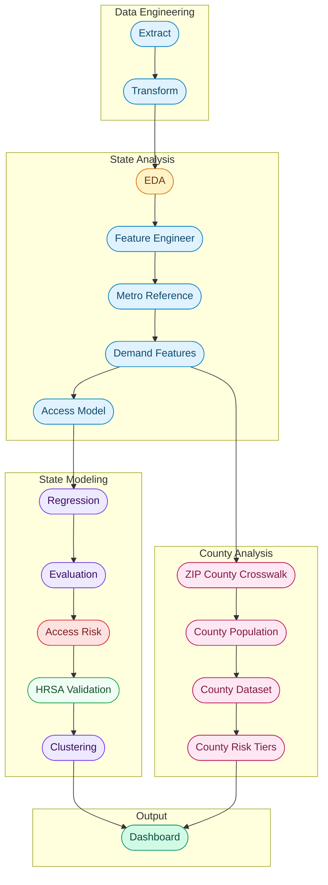

<div align="center">

# Ovara

### Reproductive Health Provider Access Modeling


**University of Maryland, College of Information | INST737: Data Science Techniques | Final Project**

[View Dashboard](#running-the-project) · [Pipeline Stages](#pipeline-stages) · [Data Sources](#data-and-sources) · [Methodology](METHODOLOGY.md) · [Future Work](#next-steps-and-future-considerations)

---

</div>

## Project Overview

Ovara started from a simple observation: fertility and reproductive healthcare access in the United States is not evenly distributed. I first noticed this while working as a Healthcare Data Analyst for a management consulting company that operated multiple Minimally Invasive Gynecologic Surgery focused Ambulatory Surgery Centers across major East Coast metro areas. The centers were consistently full, patients often traveled long distances for care, and specialty referrals were a normal part of operations. That made me question whether this was just a local business issue or part of a larger access problem.

The challenge is that much of the data needed to study this problem already exists, but it sits inside fragmented federal registries that are difficult to work with. This project builds a data science pipeline that turns raw provider registry data into measurable access intelligence.

The pipeline ingests the CMS National Provider Identifier registry, also known as NPPES, which includes over 8 million healthcare providers. It filters that data to reproductive health specialties including OB/GYNs, Reproductive Endocrinologists, Certified Nurse Midwives, and Women's Health Nurse Practitioners. It then joins providers with Census population data to create geographic density features, estimate expected provider supply through regression modeling, and classify states and counties by access risk.

> **Core question:** Given a state's population and workforce characteristics, how many reproductive health providers should we expect, and where does reality fall short?

States with large negative residuals between predicted and actual provider density are flagged as potentially underserved. This turns a basic mapping project into an access gap detection framework.

---

## Data and Sources

<details>
<summary><strong>Primary Datasets</strong></summary>

<br>

The NPPES registry provides provider identity, taxonomy classification, practice location, and enrollment timeline for every registered healthcare provider in the country. Census CBSA delineation files and metropolitan population estimates provide the demand side denominator for density calculations. HRSA shortage designations are used later as an external validation benchmark.

| Source | Description | URL |
|---|---|---|
| CMS NPPES | National provider registry with roughly 8 million providers | [download.cms.gov](https://download.cms.gov/nppes/NPI_Files.html) |
| Census CBSA | Metropolitan population estimates | [census.gov](https://www.census.gov/programs-surveys/metro-micro.html) |
| HealthData.gov | Supporting health datasets | [healthdata.gov](https://healthdata.gov) |
| HRSA | Health workforce and shortage designation data | [data.hrsa.gov](https://data.hrsa.gov) |
| KFF | Health policy research and context | [kff.org](https://www.kff.org) |

</details>

<details>
<summary><strong>Techniques</strong></summary>

<br>

| Technique | Library | Purpose |
|---|---|---|
| Linear Regression | scikit learn | Estimate expected provider density |
| Quartile Classification | pandas | Assign access risk tiers from residuals |
| Density Threshold Classification | pandas | Assign county level access tiers from raw provider density |
| K Means Clustering | scikit learn | Segment states into supply archetypes |
| Silhouette Scoring | scikit learn | Select optimal cluster count |
| Cross Validation | scikit learn | Evaluate model generalization |
| External Validation | requests and scipy | Benchmark risk tiers against HRSA HPSA designations |
| Interactive Dashboard | Dash and Plotly | Explore access gaps by state and county |
| County Choropleth | Plotly Choroplethmapbox | Pan and scroll zoom across 3,144 counties |
| EDA Visualization | matplotlib | Show specialty distribution and growth trends |

</details>

<details>
<summary><strong>Reproductive Health Taxonomy Scope</strong></summary>

<br>

Rather than analyzing all healthcare providers, Ovara filters the NPPES dataset during the transform stage to 13 NUCC taxonomy codes that represent the reproductive and women's health workforce.

| Category | Specialties | Codes |
|---|---|---|
| **OB/GYN** | General, Gynecology, Obstetrics, Maternal Fetal Medicine, Reproductive Endocrinology, Female Pelvic Medicine and Reconstructive Surgery, Gynecologic Oncology, Critical Care, REI | `207V*` family |
| **Midwifery** | Certified Nurse Midwife, Midwife | `367A00000X`, `176B00000X` |
| **Nurse Practitioner** | Women's Health NP | `363LW0102X` |

The full code to label mapping is defined in `REPRODUCTIVE_HEALTH_TAXONOMY` in `etl/transform.py`.

</details>

---

## Setup Instructions

```bash
# 1. Clone the repository
git clone https://github.com/kennethyeaher/inst737-final-project-kenneth-yeaher.git
cd inst737-final-project-kenneth-yeaher

# 2. Create and activate a virtual environment
python -m venv .venv
source .venv/bin/activate

# 3. Install dependencies
pip install -r requirements.txt

# 4. Install the project in editable mode so modules import cleanly
pip install -e .
```

> **Note:** The raw NPPES file is not included because it is roughly 11 GB. Download the latest weekly NPI data file from [CMS NPPES](https://download.cms.gov/nppes/NPI_Files.html), place the extracted CSV in `data/extracted/nppes_weekly_raw/`, then run `python etl/preprocess_nppes.py` to filter to reproductive health providers before running the full pipeline.

---

## Running the Project

```bash
# Run the full pipeline
python main.py

# Launch the interactive dashboard separately
python vis/interactive_visualizations.py
```

Open [http://127.0.0.1:8050](http://127.0.0.1:8050) in your browser. Click any state on the map to filter the bar chart. Use **Reset** to return to the default view.

---

## Code Package Structure

| Type | Path | Description |
|---|---|---|
| **Folder** | **`analysis/`** | **Modeling and analytics modules** |
| File | `access_risk_model.py` | Residual based state risk classification |
| File | `build_access_model_dataset.py` | State level supply plus population merge |
| File | `build_county_dataset.py` | County level provider features and density build |
| File | `build_county_population.py` | Census ACS 5 year county population reference |
| File | `build_demand_features.py` | Fertility age demand features from Census ACS |
| File | `build_metro_dataset.py` | Census CBSA reference construction |
| File | `build_model_dataset.py` | ZIP level feature engineering |
| File | `build_zip_county_crosswalk.py` | ZIP code to county FIPS lookup from Census ZCTA file |
| File | `clustering_model.py` | K Means state supply archetype segmentation |
| File | `county_risk_classification.py` | Density threshold tier assignment for counties |
| File | `eda_provider.py` | Exploratory visualizations |
| File | `evaluate.py` | Model evaluation and diagnostics |
| File | `hrsa_validation.py` | External validation against HRSA HPSA shortage designations |
| File | `regression_model.py` | Provider density regression |
| **Folder** | **`etl/`** | **Extract and transform pipeline** |
| File | `extract.py` | NPPES raw file ingestion |
| File | `preprocess_nppes.py` | One time NPPES filter to reproductive health taxonomy codes |
| File | `transform.py` | Cleaning, filtering, and standardization |
| **Folder** | **`vis/`** | **Visualization and dashboard modules** |
| File | `_styles.py` | Shared color, font, and layout tokens |
| File | `_components.py` | Reusable widgets including KPI cards and state detail cards |
| File | `county_visualizations.py` | County choropleth, county bar chart, and county components |
| File | `dashboard.py` | Layout assembly and callback registration |
| File | `exports.py` | Static HTML exports for the four state level figures |
| File | `interactive_visualizations.py` | Thin entry point that runs the dashboard workflow |
| File | `state_charts.py` | State level chart builders for bar, scatter, and choropleth charts |
| File | `summary_text.py` | Executive summary text for the dashboard |
| **Folder** | **`utils/`** | **Shared configuration and helpers** |
| File | `cache.py` | `load_or_fetch` wrapper for cached external downloads |
| File | `fips.py` | Single source FIPS to state mapping |
| File | `io.py` | `save_csv` and `save_json` helpers with logging |
| File | `logging_config.py` | Centralized pipeline logging configuration |
| File | `pipeline.py` | `Stage` dataclass plus `run_pipeline` runner |
| **Folder** | **`data/`** | **Pipeline data artifacts** |
| Subfolder | `extracted/` | Raw standardized datasets |
| Subfolder | `transformed/` | Cleaned modeling ready datasets |
| Subfolder | `load/` | Feature engineered datasets |
| Subfolder | `model_outputs/` | Regression, risk classification, and evaluation results |
| Subfolder | `reference_tables/` | Data dictionaries and geographic reference files |
| Subfolder | `visualizations/` | Generated charts |
| File | `main.py` | Full pipeline entry point |
| File | `pyproject.toml` | Package metadata for `pip install -e .` |
| File | `requirements.txt` | Pinned dependencies |

---

## Pipeline Stages



---

<details>
<summary><strong>1. Extract</strong> | <code>data/extracted/nppes_provider_raw.csv</code></summary>

<br>

Loads the weekly NPPES provider file and selects only the columns needed for geographic and specialty analysis. The full file contains over 8 million rows and 330 columns, so extraction narrows it to 17 core fields covering provider identity, taxonomy, practice location, and enrollment dates.

</details>

<details>
<summary><strong>2. Transform</strong> | <code>data/transformed/nppes_provider_clean.csv</code></summary>

<br>

Filters to active providers, applies the reproductive health taxonomy filter defined in `REPRODUCTIVE_HEALTH_TAXONOMY`, standardizes column names to snake case, cleans ZIP and state geography, removes duplicate NPIs, and parses date fields. This is the stage where the dataset shifts from general provider data to reproductive health focused data.

</details>

<details>
<summary><strong>3. Exploratory Data Analysis</strong> | <code>data/visualizations/</code></summary>

<br>

Generates three visualizations from the filtered dataset: a ranked horizontal bar chart of reproductive health provider counts by state, a specialty breakdown showing how providers distribute across OB/GYN subspecialties versus midwifery and NP roles, and an annual enumeration trend chart that identifies workforce growth patterns while handling partial year data quality issues.

</details>

<details>
<summary><strong>4. Geographic Feature Engineering</strong> | <code>data/load/provider_geo_features.csv</code></summary>

<br>

Aggregates the cleaned provider dataset to the ZIP level, producing four supply indicators: provider count, taxonomy diversity, provider maturity, and recent provider growth. Provider maturity uses average enumeration year as a proxy for workforce age. Recent growth counts providers enumerated in the last three years.

</details>

<details>
<summary><strong>5. Metro Reference Dataset</strong> | <code>data/load/cbsa_reference_dataset.csv</code></summary>

<br>

Builds a Census aligned metropolitan reference dataset by merging CBSA delineation files with population estimates. The output maps each county to its metropolitan statistical area and carries the 2024 population estimate used as the demand denominator in density calculations.

</details>

<details>
<summary><strong>6. Demand Features</strong> | <code>data/reference_tables/acs_female_25_44_by_state.csv</code></summary>

<br>

Fetches fertility age female population, women 25 to 44, by state from the Census ACS B01001 table through the Census API. The output is cached locally so the pipeline can run offline after the first fetch. These demand side counts are joined in the Access Model stage to compute a demand adjusted provider density.

</details>

<details>
<summary><strong>7. ZIP to County Crosswalk</strong> | <code>data/reference_tables/zip_county_lookup.csv</code></summary>

<br>

Downloads the Census 2020 ZCTA to county relationship file and assigns each ZIP code to the county that contains its largest land area share. The result is a clean ZIP to county FIPS lookup that the county dataset stage uses to roll up providers. The raw Census file is cached locally so the pipeline can run offline after the first fetch.

</details>

<details>
<summary><strong>8. County Population</strong> | <code>data/reference_tables/county_population.csv</code></summary>

<br>

Pulls total population for every US county from Census ACS 5 year table B01003 through the Census API. ACS 5 year is used instead of ACS 1 year because it covers all 3,144 counties, including small rural counties that ACS 1 year omits. This table is used as the denominator for county density calculations.

</details>

<details>
<summary><strong>9. County Dataset</strong> | <code>data/load/county_access_dataset.csv</code></summary>

<br>

Joins providers to counties through the ZIP crosswalk, aggregates supply features at the county level, then merges with county population to compute providers per 100,000 residents for every county. Provider features include provider count, taxonomy diversity, average provider enumeration year, and recent provider growth. Counties with zero providers stay in the dataset so they can be flagged as access deserts in the next stage.

</details>

<details>
<summary><strong>10. County Risk Classification</strong> | <code>data/model_outputs/county_risk_classified.csv</code></summary>

<br>

Classifies counties into five access tiers using fixed density thresholds instead of residual quartiles. The thresholds are designed to call out meaningful supply levels rather than only relative ranking.

| Tier | Density per 100k | Counties | Population |
|---|---|---:|---:|
| Access Desert | 0.0 | 1,038 | 14.5M |
| Critical | 0.0 to 5.0 | 154 | 6.6M |
| Underserved | 5.0 to 10.0 | 314 | 11.3M |
| Adequate | 10.0 to 20.0 | 594 | 52.6M |
| Well Served | over 20.0 | 1,044 | 246.1M |

Each county also receives a continuous risk score from 0 to 100 and a national rank.

</details>

<details>
<summary><strong>11. Access Model Dataset</strong> | <code>data/load/access_model_dataset.csv</code></summary>

<br>

Merges state level supply features with metro population totals and fertility age demand counts, then computes provider density as providers per 100,000 residents. This is the modeling ready dataset that feeds the regression model.

</details>

<details>
<summary><strong>12. Regression Model</strong> | <code>data/model_outputs/regression_results.csv</code></summary>

<br>

Fits a linear regression estimating expected reproductive health provider density from five features: metro population, taxonomy diversity, recent provider growth, average provider enumeration year, and fertility age female population. The residual for each state, meaning the difference between actual and predicted density, is the core analytical signal. States where actual density falls well below the prediction are candidates for access concern.

</details>

<details>
<summary><strong>13. Model Evaluation</strong> | <code>data/model_outputs/evaluation_results.json</code></summary>

<br>

Runs 5 fold cross validation, computes standardized feature coefficients for scale independent importance analysis, performs residual diagnostics, and benchmarks the model against a naive baseline. Residual diagnostics include skewness, kurtosis, and outlier detection. Structured results are saved as JSON and per state detail is saved as CSV.

</details>

<details>
<summary><strong>14. Access Risk Classification</strong> | <code>data/model_outputs/access_risk_classified.csv</code></summary>

<br>

Converts regression residuals into usable risk labels. Each state receives a continuous risk score from 0 to 100, where 100 is most underserved. Each state also receives a categorical tier assignment based on residual quartile position: high risk, moderate risk, adequate, or well served. Supply gap magnitude, severity ranking, and threshold metadata are saved for reproducibility.

</details>

<details>
<summary><strong>15. HRSA External Validation</strong> | <code>data/model_outputs/hrsa_validation.csv</code></summary>

<br>

Benchmarks Ovara's access risk tiers against HRSA Health Professional Shortage Area Primary Care designations fetched from the HRSA data warehouse. Active HPSA designations are aggregated to the state level to produce shortage burden metrics, including count of designated areas, total shortage population, average HPSA score, and estimated FTE shortage.

These metrics are joined with Ovara's risk output and evaluated for agreement. The validation computes precision and recall for the `high_risk` tier against HRSA flagged states, F1 score, overall agreement rate, and Spearman correlation between Ovara's continuous risk score and HRSA shortage measures. HRSA data is cached locally after the first fetch.

</details>

<details>
<summary><strong>16. Clustering</strong> | <code>data/model_outputs/clustering_results.csv</code></summary>

<br>

Segments states into supply archetypes using K Means on four rate based features: provider density per 100k, taxonomy diversity, growth rate per 100k, and average provider enumeration year. Features are standardized with `StandardScaler`, and the optimal cluster count is selected by a silhouette score sweep across k = 2 through k = 6.

Cluster ids are relabeled by ascending mean density so cluster 1 is always the lowest supply archetype. Human readable labels such as `low_supply`, `mid_supply`, and `high_supply` are added. A 2D PCA scatter is exported for presentation use.

</details>

<details>
<summary><strong>17. Interactive Dashboard</strong> | <code>http://127.0.0.1:8050</code></summary>

<br>

A Dash web application with two views, controlled by a State Level vs County Level toggle at the top of the page.

**State view** shows residual based access tiers across the 51 states. It includes a USA choropleth that can toggle between Access Gap and Risk Tier coloring, a filterable bar chart of the most underserved states, a predicted vs actual scatter with outlier annotations, KPI cards, and an automatically generated executive summary. Clicking a state filters the detail view.

**County view** shows density threshold tiers across all 3,144 counties. It uses Plotly Choroplethmapbox so users can pan and scroll zoom into individual counties. A state filter dropdown frames the map around the chosen state. The bar chart shows the most underserved counties that have at least one provider, while access deserts get their own KPI tile. Clicking a county brings up a detail card. The map is updated with Dash Patch on click so selecting a county does not re render all 3,144 polygons.

> **Known limitation:** Connecticut is missing from the county map. The Census Bureau switched Connecticut from county based geography to nine Planning Regions in 2022. The county data uses the new Planning Region FIPS codes, but the bundled Plotly geojson still has the old county FIPS codes. Connecticut data is correct in the underlying CSV but does not render on the map until the geojson is refreshed.

</details>

---

## Logging and Error Handling

The pipeline uses Python's `logging` module with centralized configuration in `utils/logging_config.py`. All output is written to both the console and `logs/ovara_pipeline.log`, replacing earlier `print()` statements with structured logging.

Each pipeline stage is declared in `main.py` as a `Stage` dataclass defined in `utils/pipeline.py`. Each stage has a runner function and a critical flag. The list of stages is handed to `run_pipeline`, which executes them in order with consistent banner logging and error handling.

Critical stages stop the pipeline on failure because downstream stages depend on their output. These include extract, transform, model dataset, metro reference, access model, and regression. Noncritical stages log a warning and let the pipeline continue. These include EDA, demand features, county work, evaluation, access risk, HRSA validation, clustering, and visualization.

Individual modules use targeted exception handling for common failure modes: `FileNotFoundError` for missing upstream outputs, `ValueError` for column validation failures, and `KeyError` for schema mismatches. Data quality signals such as dropped rows and missing merge keys are logged at the `WARNING` level for easier filtering.

Save and load patterns also live in shared helpers. `utils/io.py` provides `save_csv` and `save_json`, which handle directory creation and consistent logging. `utils/cache.py` provides `load_or_fetch` for cached external downloads used by the Census ACS, ZCTA crosswalk, and HRSA stages.

---

## Data Management

### Data Dictionaries

Each analytical dataset has a corresponding data dictionary stored in `data/reference_tables/` following the naming convention `data_dictionary_[dataset_name].csv`.

| Dictionary | Dataset | Fields |
|---|---|---:|
| `data_dictionary_nppes_provider_clean.csv` | Cleaned provider level dataset | 18 |
| `data_dictionary_provider_geo_features.csv` | ZIP level engineered features | 6 |
| `data_dictionary_cbsa_reference_dataset.csv` | Census metro reference | 8 |
| `data_dictionary_access_model_dataset.csv` | State level access modeling dataset | 10 |
| `data_dictionary_acs_female_25_44_by_state.csv` | Fertility age demand features by state | 6 |
| `data_dictionary_regression_results.csv` | Regression model outputs with residuals | 10 |
| `data_dictionary_access_risk_classified.csv` | Access risk tier classification by state | 13 |
| `data_dictionary_access_risk_summary.csv` | Risk tier aggregate statistics | 6 |
| `data_dictionary_evaluation_detail.csv` | Per state model evaluation detail | 6 |
| `data_dictionary_clustering_results.csv` | State supply archetype clustering output | 8 |
| `data_dictionary_hrsa_validation.csv` | HRSA HPSA external validation output | 10 |

### Reference Tables

| File | Purpose |
|---|---|
| `cbsa_reference_dataset.csv` | Maps CBSA codes to county FIPS, state names, and 2024 population estimates |
| `acs_female_25_44_by_state.csv` | Female population aged 25 to 44 by state from Census ACS used as fertility age demand proxy |
| `zip_county_lookup.csv` | ZIP code to county FIPS lookup from the Census 2020 ZCTA relationship file |
| `county_population.csv` | Total population per county from Census ACS 5 year, used as the county density denominator |
| `counties_geojson.json` | County boundary geojson used by the county choropleth map |
| `hrsa_hpsa_raw.csv` | Cached HRSA Primary Care HPSA designations used by the validation stage |
| `REPRODUCTIVE_HEALTH_TAXONOMY` | In code reference table in `etl/transform.py` defining 13 NUCC codes |
| `FIPS_TO_STATE` | In code reference table in `utils/fips.py` mapping FIPS codes to state abbreviations |

---

## Next Steps and Future Considerations

| Enhancement | Description | Impact |
|---|---|---|
| **CDC ART Integration** | Join CDC fertility clinic treatment data from roughly 500 clinics | Add treatment volume and outcomes as a second access dimension |
| **Network Modeling** | Neo4j graph analysis of provider, clinic, metro, and referral relationships | Shift from density based access measurement to connectivity based access measurement |
| **ZIP Level Drill Down** | ZIP level choropleth with risk tier overlays | Push geographic resolution below county level for more targeted planning |
| **Refresh County Geojson** | Replace the bundled county geojson with a 2024 Census TIGER pull that includes Connecticut Planning Regions | Restore Connecticut to the county choropleth |
| **Add CT Crosswalk Patch** | Map old Connecticut county FIPS codes used by NPPES ZIPs to the new Planning Region FIPS | Route Connecticut providers to the right new region so the access desert flag is accurate |

---

<div>

## Author

**Kenneth Yeaher**  
Master of Information Management, Class of 2027  
University of Maryland, College Park  
[](https://www.linkedin.com/in/kennethyeaher/)

`Healthcare Analytics` · `Data Science` · `Data Visualization` · `Geographic Modeling`

</div>