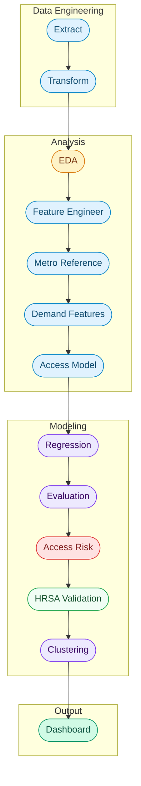

<div align="center">

# Ovara

### Reproductive Health Provider Access Modeling


**University of Maryland, College of Information - INST737: Data Science Techniques - Final Project**

[View Dashboard](#running-the-project) · [Pipeline Stages](#pipeline-stages) · [Data Sources](#data-and-sources) · [Methodology](METHODOLOGY.md) · [Future Work](#next-steps-and-future-considerations)
 
---
 
</div>

## Project Overview

Ovara started from a simple observation: fertility and reproductive healthcare access in the United States is not evenly distributed. Something I observed while working as a Healthcare Data Analyst for a Management Consulting company that ran multiple Minimally Invasive Gynecologic Surgery focus Ambulatory Surgery Centers scattered though the top metro cities on the east coast. However, most of the data that could prove this sits in fragmented federal registries that are difficult to work with. This project builds a data science pipeline to turn that raw registry data into measurable access intelligence.

The pipeline ingests the CMS National Provider Identifier (NPPES) registry, a dataset of over 8 million healthcare providers, and filters it to reproductive health specialties including OB/GYNs, Reproductive Endocrinologists, Certified Nurse Midwives, and Women's Health Nurse Practitioners. It then merges these providers with Census metropolitan population estimates to construct geographic density features, estimate expected provider supply through regression modeling, and classify states by access risk based on where actual supply deviates from predictions.

> **Core question:** Given a state's population and workforce characteristics, how many reproductive health providers should we expect, and where does reality fall short? 

States with large negative residuals between predicted and actual provider density are flagged as potentially underserved. This converts a descriptive mapping exercise into a predictive access gap detection framework.

---

## Data and Sources 

<details>
<summary><strong>Primary Datasets</strong></summary>
 
<br>

The NPPES registry provides provider identity, taxonomy classification, practice location, and enrollment timeline for every registered healthcare provider in the country. Census CBSA delineation files and metropolitan population estimates supply the demand side denominator for density calculations. Both are publicly available federal sources updated regularly.

| Source | Description | URL |
|---|---|---|
| CMS NPPES | National provider registry (~8M providers) | [download.cms.gov](https://download.cms.gov/nppes/NPI_Files.html) |
| Census CBSA | Metropolitan population estimates | [census.gov](https://www.census.gov/programs-surveys/metro-micro.html) |
| HealthData.gov | Supporting health datasets | [healthdata.gov](https://healthdata.gov) |
| HRSA | Health workforce data | [data.hrsa.gov](https://data.hrsa.gov) |
| KFF | Health policy research | [kff.org](https://www.kff.org) |


</details>
 
<details>
<summary><strong>Techniques</strong></summary>
 
<br>

| Technique | Library | Purpose |
|---|---|---|
| Linear Regression | scikit-learn | Estimate expected provider density |
| Quartile Classification | pandas | Assign access risk tiers from residuals |
| K-Means Clustering | scikit-learn | Segment states into supply archetypes |
| Silhouette Scoring | scikit-learn | Select optimal cluster count |
| Cross Validation | scikit-learn | Evaluate model generalization |
| External Validation | requests + scipy | Benchmark risk tiers against HRSA HPSA designations |
| Interactive Dashboard | Dash + Plotly | Explore access gaps by state |
| EDA Visualization | matplotlib | Specialty distribution and growth trends |

</details>
 
<details>
<summary><strong>Reproductive Health Taxonomy Scope</strong></summary>
 
<br>

Rather than analyzing all healthcare providers generically, Ovara filters the NPPES dataset during the transform stage to 13 NUCC taxonomy codes that represent the reproductive and women's health workforce. 

| Category | Specialties | Codes |
|---|---|---|
| **OB/GYN** | General, Gynecology, Obstetrics, Maternal-Fetal Medicine, Reproductive Endocrinology, Female Pelvic Medicine and Reconstructive Surgery, Gynecologic Oncology, Critical Care, REI | `207V*` family |
| **Midwifery** | Certified Nurse Midwife, Midwife | `367A00000X`, `176B00000X` |
| **Nurse Practitioner** | Women's Health NP | `363LW0102X` |

The full code to label mapping is defined in `REPRODUCTIVE_HEALTH_TAXONOMY` in `etl/transform.py`.
 
</details>
 
---
 
## Setup Instructions

```bash
# 1. Clone the repository
git clone https://github.com/kennethyeaher/inst737-final-project-kenneth-yeaher.git
cd inst737-final-project-kenneth-yeaher

# 2. Create and activate a virtual environment:
python -m venv .venv
source .venv/bin/activate

# 3. Install dependencies:
pip install -r requirements.txt
```

> **NOTE:** The NPPES raw data file is not included due to size (~11 GB). Download the latest weekly NPI data file from [CMS NPPES](https://download.cms.gov/nppes/NPI_Files.html), place the extracted CSV in `data/extracted/nppes_weekly_raw/`, then run `python preprocess_nppes.py` to filter to reproductive health providers before running the pipeline.

---

## Running the Project

```bash
# Run the full pipeline end to end
python main.py

# Or launch the interactive dashboard separately
python vis/interactive_visualizations.py
```

Open [http://127.0.0.1:8050](http://127.0.0.1:8050) in your browser. Click any state on the map to filter the bar chart. Hit **Reset** to restore the default view.

---

## Code Package Structure

| Type | Path | Description |
|---|---|---|
| **Folder** | **`analysis/`** | **Modeling and analytics modules** |
| File | `access_risk_model.py` | Residual based risk classification |
| File | `build_access_model_dataset.py` | State level supply + population merge |
| File | `build_demand_features.py` | Fertility-age demand features from Census ACS |
| File | `build_metro_dataset.py` | Census CBSA reference construction |
| File | `build_model_dataset.py` | ZIP level feature engineering |
| File | `hrsa_validation.py` | External validation against HRSA HPSA shortage designations |
| File | `clustering_model.py` | K-Means state supply archetype segmentation |
| File | `eda_provider.py` | Exploratory visualizations |
| File | `evaluate.py` | Model evaluation and diagnostics |
| File | `regression_model.py` | Provider density regression |
| **Folder** | **`etl/`** | **Extract and transform pipeline** |
| File | `extract.py` | NPPES raw file ingestion |
| File | `transform.py` | Cleaning, filtering, standardization |
| **Folder** | **`vis/`** | **Visualization and dashboard** |
| File | `interactive_visualizations.py` | Dash web application |
| **Folder** | **`utils/`** | **Shared configuration and helpers** |
| File | `logging_config.py` | Centralized pipeline logging configuration |
| **Folder** | **`data/`** | **Pipeline data artifacts** |
| Subfolder | `extracted/` | Raw standardized datasets |
| Subfolder | `transformed/` | Cleaned modeling ready datasets |
| Subfolder | `load/` | Feature engineered datasets |
| Subfolder | `model_outputs/` | Regression, risk classification, and evaluation results |
| Subfolder | `reference_tables/` | Data dictionaries and geographic reference files |
| Subfolder | `visualizations/` | Generated charts |
| File | `main.py` | Full pipeline entry point |
| File | `preprocess_nppes.py` | One time NPPES preprocessing script |
| File | `requirements.txt` | Dependencies |

---

## Pipeline Stages



---

<details>
<summary><strong>1. Extract</strong> — <code>data/extracted/nppes_provider_raw.csv</code></summary>
 
<br>
 
Loads the weekly NPPES provider file and selects only the columns needed for geographic and specialty analysis. The full file contains over 8 million rows and 330 columns, the extraction narrows this to 17 core fields covering provider identity, taxonomy, practice location, and enrollment dates.
</details>
 
<details>
<summary><strong>2. Transform</strong> — <code>data/transformed/nppes_provider_clean.csv</code></summary>
 
<br>
 
Filters to active providers, applies the reproductive health taxonomy filter defined in `REPRODUCTIVE_HEALTH_TAXONOMY`, standardizes column names to snake_case, cleans ZIP and state geography, removes duplicate NPIs, and parses date fields. This is the stage where the dataset shifts from general purpose to reproductive health focused.
</details>
 
<details>
<summary><strong>3. Exploratory Data Analysis</strong> — <code>data/visualizations/</code></summary>
 
<br>
 
Generates three visualizations from the filtered dataset: a ranked horizontal bar chart of reproductive health provider counts by state, a specialty breakdown showing how providers distribute across OB/GYN subspecialties versus midwifery and NP roles, and an annual enumeration trend chart that identifies workforce growth patterns while handling partial year data quality issues.
</details>
 
<details>
<summary><strong>4. Geographic Feature Engineering</strong> — <code>data/load/provider_geo_features.csv</code></summary>
 
<br>
 
Aggregates the cleaned provider dataset to the ZIP level, producing four supply indicators: provider count, taxonomy diversity (number of unique specialties), provider maturity (average enumeration year as a proxy for workforce age), and recent provider growth (providers enumerated in the last three years).
</details>
 
<details>
<summary><strong>5. Metro Reference Dataset</strong> — <code>data/load/cbsa_reference_dataset.csv</code></summary>
 
<br>
 
Builds a Census aligned metropolitan reference dataset by merging CBSA delineation files with population estimates. The output maps each county to its metropolitan statistical area and carries the 2024 population estimate used as the demand denominator in density calculations.
</details>
 
<details>
<summary><strong>6. Demand Features</strong> — <code>data/reference_tables/acs_female_25_44_by_state.csv</code></summary>
 
<br>
 
Fetches fertility-age female population (women 25–44) by state from the Census ACS B01001 table via the Census API. The output is cached locally so the pipeline can run offline after the first fetch. These demand-side counts are joined in the Access Model stage to compute a demand-adjusted provider density.
</details>
 
<details>
<summary><strong>7. Access Model Dataset</strong> — <code>data/load/access_model_dataset.csv</code></summary>
 
<br>
 
Merges state level supply features with metro population totals and fertility-age demand counts, then computes provider density as providers per 100,000 residents. This is the modeling ready dataset that feeds the regression model.
</details>
 
<details>
<summary><strong>8. Regression Model</strong> — <code>data/model_outputs/regression_results.csv</code></summary>
 
<br>
 
Fits a linear regression estimating expected reproductive health provider density from five features: metro population, taxonomy diversity, recent provider growth, average provider enumeration year, and fertility-age female population. The residual for each state, the difference between actual and predicted density, is the core analytical signal. States where actual density falls well below the prediction are candidates for access concern.
</details>
 
<details>
<summary><strong>9. Model Evaluation</strong> — <code>data/model_outputs/evaluation_results.json</code></summary>
 
<br>
 
Runs 5 fold cross validation, computes standardized feature coefficients for scale independent importance analysis, performs residual diagnostics (skewness, kurtosis, outlier detection), and benchmarks against a naive baseline. Saves structured results as JSON and per state detail as CSV.
</details>
 
<details>
<summary><strong>10. Access Risk Classification</strong> — <code>data/model_outputs/access_risk_classified.csv</code></summary>
 
<br>
 
Converts regression residuals into actionable risk labels. Each state receives a continuous risk score (0–100, where 100 is most underserved), a categorical tier assignment based on residual quartile position (high risk, moderate risk, adequate, well served), a supply gap magnitude, and a severity ranking. Threshold metadata is saved separately for reproducibility.
</details>
 
<details>
<summary><strong>11. HRSA External Validation</strong> — <code>data/model_outputs/hrsa_validation.csv</code></summary>
 
<br>
 
Benchmarks Ovara's access risk tiers against the HRSA Health Professional Shortage Area (HPSA) Primary Care designations fetched directly from the HRSA data warehouse. Active HPSA designations are aggregated to the state level to produce shortage burden metrics: count of designated areas, total population in shortage, average HPSA score, and estimated FTE shortage. These are joined with Ovara's risk output and evaluated for agreement: precision and recall comparing the `high_risk` tier against HRSA-flagged states, an F1 score, overall agreement rate, and a Spearman correlation between Ovara's continuous risk score and HRSA shortage population. The validation quantifies how well Ovara's purely statistical model aligns with the federal government's independently assigned shortage designations. HRSA data is cached locally after the first fetch.
</details>
 
<details>
<summary><strong>12. Clustering</strong> — <code>data/model_outputs/clustering_results.csv</code></summary>
 
<br>
 
Segments states into supply archetypes using K-Means on four rate-based features: provider density per 100k, taxonomy diversity, growth rate per 100k, and average provider enumeration year. Features are standardized with `StandardScaler` and the optimal cluster count is selected by silhouette score sweep across k=2 through k=6. Cluster ids are then relabeled by ascending mean density so cluster 1 is always the lowest-supply archetype, with human-readable labels (`low_supply`, `mid_supply`, `high_supply`, etc.). A 2D PCA scatter is exported for presentation use.
</details>
 
<details>
<summary><strong>13. Interactive Dashboard</strong> — <code>http://127.0.0.1:8050</code></summary>
 
<br>
 
A Dash web application that visualizes reproductive health provider density by state through a choropleth map, filterable bar charts, predicted vs actual scatter with outlier annotations, KPI cards, and an auto-generated executive summary. Clicking a state on the map filters the detail view.
</details>

---

## Logging and Error Handling

The pipeline uses Python's `logging` module with a centralized configuration in `utils/logging_config.py`. All output is written to both the console and `logs/ovara_pipeline.log`, replacing earlier `print()` statements with structured, level-aware logging.

Each pipeline stage in `main.py` is wrapped in its own `try/except` block. Critical stages (extract, transform, model dataset, metro reference, access model, regression) halt the pipeline on failure because downstream stages depend on their output. Non-critical stages (EDA, demand features, evaluation, access risk, visualization) log errors and allow the pipeline to continue.

Individual modules use targeted exception handling for common failure modes: `FileNotFoundError` for missing upstream outputs, `ValueError` for column validation failures, and `KeyError` for schema mismatches. Data quality signals such as dropped rows and missing merge keys are logged at `WARNING` level for easy filtering.

---

## Data Management
 
### Data Dictionaries
 
Each analytical dataset has a corresponding data dictionary stored in `data/reference_tables/` following the naming convention `data_dictionary_[dataset_name].csv`.
 
| Dictionary | Dataset | Fields |
|---|---|---|
| `data_dictionary_nppes_provider_clean.csv` | Cleaned provider level dataset | 18 |
| `data_dictionary_provider_geo_features.csv` | ZIP level engineered features | 6 |
| `data_dictionary_cbsa_reference_dataset.csv` | Census metro reference | 8 |
| `data_dictionary_access_model_dataset.csv` | State level access modeling dataset | 10 |
| `data_dictionary_acs_female_25_44_by_state.csv` | Fertility-age demand features by state | 6 |
| `data_dictionary_regression_results.csv` | Regression model outputs with residuals | 10 |
| `data_dictionary_access_risk_classified.csv` | Access risk tier classification by state | 13 |
| `data_dictionary_access_risk_summary.csv` | Risk tier aggregate statistics | 6 |
| `data_dictionary_evaluation_detail.csv` | Per-state model evaluation detail | 6 |
| `data_dictionary_clustering_results.csv` | State supply archetype clustering output | 8 |
| `data_dictionary_hrsa_validation.csv` | HRSA HPSA external validation output | 10 |
 
### Reference Tables
 
| File | Purpose |
|---|---|
| `cbsa_reference_dataset.csv` | Maps CBSA codes to county FIPS, state names, and 2024 population estimates |
| `acs_female_25_44_by_state.csv` | Female population aged 25–44 by state from Census ACS used as fertility-age demand proxy |
| `REPRODUCTIVE_HEALTH_TAXONOMY` | In code reference table in `etl/transform.py` defining 13 NUCC codes |
 
## Next Steps and Future Considerations

| Enhancement | Description | Impact |
|---|---|---|
| **CDC ART Integration** | Join CDC fertility clinic treatment data (~500 clinics) | Add treatment volume and outcomes as a second access dimension |
| **Network Modeling** | Neo4j graph analysis of provider clinic metro referral networks | Shift from density based to connectivity based access measurement |
| **Geographic Drill Down** | Metro and ZIP level choropleth with risk tier overlays | Enable targeted intervention planning at sub state level |

---
 
 
<div>

## Author

**Kenneth Yeaher** 
Master of Information Management, Class of 2027 
University of Maryland, College Park  
[](https://www.linkedin.com/in/kennethyeaher/)


`Healthcare Analytics` · `Data Science` · `Data Visualization` · `Geographic Modeling`

</div>
