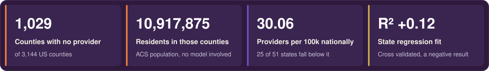
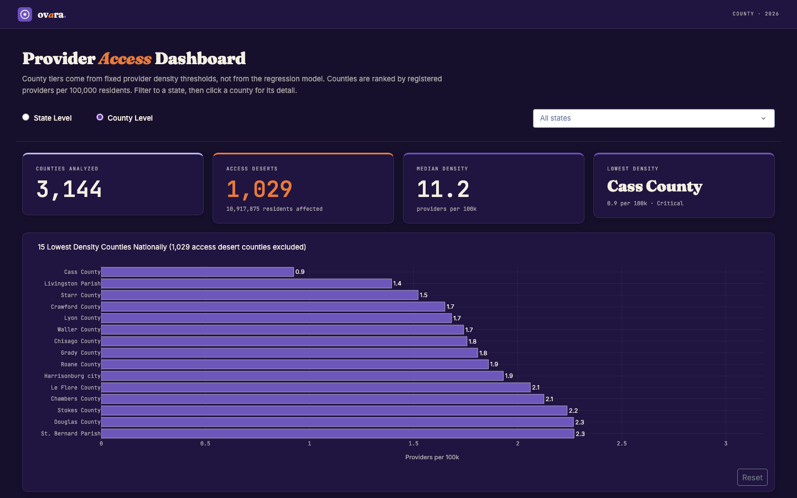
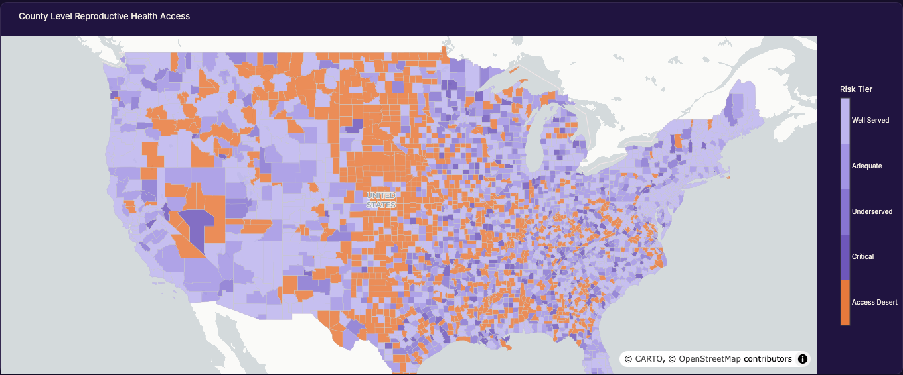
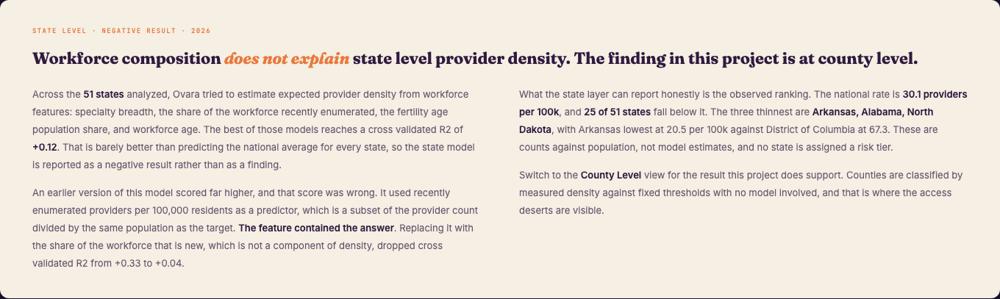
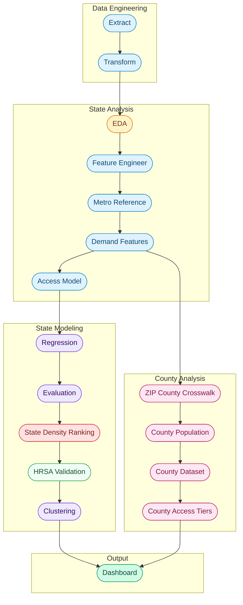

<p align="center">
  
</p>

<p align="center">
  <strong>Reproductive health provider access modeling, from the federal provider registry down to the county.</strong><br>
  University of Maryland, College of Information · INST737: Data Science Techniques · Final Project
</p>

<p align="center">
  
  
  
  
  
  
</p>

<p align="center">
  <a href="#what-the-county-data-shows"><strong>County finding</strong></a> &nbsp; · &nbsp;
  <a href="#the-state-model-is-a-negative-result">State negative result</a> &nbsp; · &nbsp;
  <a href="#known-limitations">Known limitations</a> &nbsp; · &nbsp;
  <a href="#run-it">Run it</a> &nbsp; · &nbsp;
  <a href="METHODOLOGY.md">Methodology</a>
</p>

---

## Why this exists

Ovara started from a simple observation: fertility and reproductive healthcare access in the United States is not evenly distributed. I first noticed this while working as a Healthcare Data Analyst for a management consulting company that operated multiple Minimally Invasive Gynecologic Surgery focused Ambulatory Surgery Centers across major East Coast metro areas. The centers were consistently full, patients often traveled long distances for care, and specialty referrals were a normal part of operations. That made me question whether this was just a local business issue or part of a larger access problem.

The challenge is that much of the data needed to study this problem already exists, but it sits inside fragmented federal registries that are difficult to work with. This project builds a data science pipeline that turns raw provider registry data into measurable access intelligence.



## What the county data shows

**The headline finding is at county level.** 1,029 US counties have zero registered reproductive health providers, and 10,917,875 people live in them. That is a direct count of registered providers against ACS population, classified by fixed density thresholds, with no model involved.





## What I built

The pipeline ingests the CMS National Provider Identifier registry, also known as NPPES, which includes over 8 million healthcare providers. It filters that data to reproductive health specialties including OB/GYNs, Reproductive Endocrinologists, Certified Nurse Midwives, and Women's Health Nurse Practitioners. It then joins providers with Census population data to create geographic density features, ranks states by observed density, and classifies counties by access tier.

> **Core question:** Given a state's population and workforce characteristics, how many reproductive health providers should we expect, and where does reality fall short?

## The state model is a negative result

The state level regression that this project started from is reported as a **negative result**. Workforce composition features do not explain state level provider density, and the residual based risk tiers built on them have been retired. See [Known Limitations](#known-limitations).



---

## Known Limitations

**A feature contained the answer, and the model's score was leakage.** The winning feature set used `growth_per_100k`, which is `recent_provider_growth` divided by `state_population`. The target is `provider_count` divided by `state_population`. Recently enumerated providers are a strict subset of the provider count, in all 51 states, averaging 5.8% nationally and ranging 3.0% to 12.9% by state. The feature was a component of the target over the same denominator.

Replacing the level with a composition measure, `pct_recent_entrants`, the share of a state's workforce that is new, which is not a component of density:

| Feature set | CV R2 |
|---|---:|
| `taxonomy_diversity` + `growth_per_100k`, leaking | +0.3253 |
| `taxonomy_diversity` + `pct_recent_entrants`, leak free | +0.0352 |
| `taxonomy_diversity` alone, selected | +0.1244 |

`pct_recent_entrants` correlates with density at r = -0.0891, p = 0.534. The growth signal was entirely a level effect. **The honest ceiling for this model is about R2 0.12**, and even that is partly mechanical, since a ZIP with more providers has more chances to contain more taxonomies.

A test in `tests/test_access_model_dataset.py` now fails if any feature derived from `provider_count` reappears in `FEATURE_COLUMNS`, and `feature_selection.json` carries a `leakage_check` block recording the subset relationship and the cost of removing it.

**Nothing at state level validates externally.** Against HRSA burden per 100,000 residents, observed density correlates at +0.002, -0.015, -0.109 and -0.240 for shortage population, FTE shortage, designated area count and average HPSA score. Density should correlate negatively with shortage burden. It does not, at any useful strength. The county grain does not rescue it either, for reasons set out in the HRSA section.

Together these two findings changed what this project claims. **The county analysis is the headline finding.** The state regression is reported as a negative result, and the residual based state risk tiers have been retired.

**The state provider density denominator was wrong, and every state level number moved.** `build_population_proxy` summed the CBSA reference table by state. That table has one row per county with the whole metro's population on each row, so the 29 county Atlanta MSA added its 6,411,149 residents 29 times. Georgia's denominator came to 198,940,717 against a true 10,722,325, New Jersey to 266,785,188 against 9,249,063, and Wyoming was under counted at 182,193 against 577,929. Because CBSAs cross state lines, the Washington MSA's population was credited whole to DC, whose real population is 670,587. The 51 state populations summed to 2,187,759,309, about 6.6 times the country.

The inflation ran 0.32x to 28.8x, so it scrambled the state ranking rather than scaling it. The denominator is now ACS county population summed to the state, the same table the county layer uses, and `check_population_plausible` raises if any state falls outside 400,000 to 45,000,000.

| Figure | Published before | Corrected |
|---|---:|---:|
| National density per 100k | 4.55 | 30.06 |
| Georgia denominator | 198,940,717 | 10,722,325 |
| New Jersey denominator | 266,785,188 | 9,249,063 |
| DC denominator | 6,436,489 | 670,587 |
| Wyoming denominator | 182,193 | 577,929 |
| 51 state total | 2,187,759,309 | 331,097,593 |
| Thinnest states | NJ, VA, GA, IN | AR, AL, ND, MS, NV, IA |

The corrected ordering matches published maternity care desert research. The shipped ordering contradicted it. The regression, the residuals, the clustering, both state maps and the HRSA validation all changed as a result. The county layer was never affected, because county density always divided by ACS county population.

**Connecticut was reported as a statewide access desert, and that was wrong.** The county layer assigned zero providers to all of Connecticut because two Census vintages disagreed. The ZIP to county crosswalk came from the 2020 ZCTA relationship file, which still emits Connecticut's eight legacy county codes 09001 through 09015. County population came from the 2022 ACS, the first vintage in which the nine planning regions are the county equivalent, so it holds 09110 through 09190. The two sets share no codes, the population join dropped every matched Connecticut provider, and the nine planning regions were published as access deserts with zero providers each. Nothing warned.

Connecticut ZIPs are now routed to planning regions through a vendored CTData Collaborative crosswalk, and `analysis/build_county_dataset.py` raises rather than writing zeros if a state's crosswalk geography and population geography ever diverge again.

| Figure | Published before | Corrected |
|---|---:|---:|
| CT providers in the county layer | 0 | 1,275 |
| CT planning regions with providers | 0 of 9 | 9 of 9 |
| National access desert counties | 1,038 | 1,029 |
| Residents in access deserts | 14,529,192 | 10,917,875 |

None of the nine planning regions is an access desert. Six are Well Served and three are Adequate.

Two caveats remain. The ZIP to planning region assignment is approximate at boundaries: CTData built it as a centroid nearest neighbour spatial join against 2022 Census boundaries, so a ZIP that straddles two regions is assigned whole to the region containing its centroid. And 89 Connecticut providers still fail the ZIP lookup outright, the same way providers in every other state do when their practice ZIP has no ZCTA match.

---

## Data and Sources

<details>
<summary><strong>Primary Datasets</strong></summary>

<br>

The NPPES registry provides provider identity, taxonomy classification, practice location, and enrollment timeline for every registered healthcare provider in the country. Census ACS county population provides the denominator for both the state and county density calculations. Census CBSA delineation files and metropolitan population estimates supply the metro reference table used for geographic context. HRSA shortage designations are used later as an external validation benchmark.

| Source | Description | URL |
|---|---|---|
| CMS NPPES | National provider registry with roughly 8 million providers | [download.cms.gov](https://download.cms.gov/nppes/NPI_Files.html) |
| Census CBSA | Metropolitan population estimates | [census.gov](https://www.census.gov/programs-surveys/metro-micro.html) |
| HealthData.gov | Supporting health datasets | [healthdata.gov](https://healthdata.gov) |
| HRSA | Health workforce and shortage designation data | [data.hrsa.gov](https://data.hrsa.gov) |
| KFF | Health policy research and context | [kff.org](https://www.kff.org) |
| CTData Collaborative | Connecticut ZIP to planning region crosswalk, used to reach the 2022 ACS county equivalents. Published under the MIT licence and vendored to `data/reference_tables/ct_zip_planning_region.csv` | [github.com](https://github.com/CT-Data-Collaborative/zip-to-planningregion) |

</details>

<details>
<summary><strong>Techniques</strong></summary>

<br>

| Technique | Library | Purpose |
|---|---|---|
| Linear Regression | scikit learn | Estimate expected provider density |
| Density Ranking | pandas | Rank states by observed provider density, no model |
| Density Threshold Classification | pandas | Assign county level access tiers from raw provider density |
| K Means Clustering | scikit learn | Segment states into supply archetypes |
| Silhouette Scoring | scikit learn | Select optimal cluster count |
| Cross Validation | scikit learn | Evaluate model generalization |
| External Validation | requests and scipy | Benchmark county access tiers against HRSA HPSA designations |
| Interactive Dashboard | Dash and Plotly | Explore access gaps by state and county |
| County Choropleth | Plotly Choroplethmapbox | Pan and scroll zoom across 3,144 counties |
| EDA Visualization | matplotlib | Show specialty distribution and growth trends |

</details>

<details>
<summary><strong>Reproductive Health Taxonomy Scope</strong></summary>

<br>

Rather than analyzing all healthcare providers, Ovara filters the NPPES dataset during the transform stage to 13 NUCC taxonomy codes that represent the reproductive and women's health workforce.

| Category | Specialties | Codes |
|---|---|---|
| **OB/GYN** | General, Gynecology, Obstetrics, Maternal Fetal Medicine, Reproductive Endocrinology, Female Pelvic Medicine and Reconstructive Surgery, Gynecologic Oncology, Critical Care, REI | `207V*` family |
| **Midwifery** | Certified Nurse Midwife, Midwife | `367A00000X`, `176B00000X` |
| **Nurse Practitioner** | Women's Health NP | `363LW0102X` |

The full code to label mapping is defined in `REPRODUCTIVE_HEALTH_TAXONOMY` in `etl/transform.py`.

</details>

---

## Run it

```bash
# 1. Clone the repository
git clone https://github.com/kennethyeaher/inst737-final-project-kenneth-yeaher.git
cd inst737-final-project-kenneth-yeaher

# 2. Create and activate a virtual environment
python -m venv .venv
source .venv/bin/activate

# 3. Install dependencies
pip install -r requirements.txt

# 4. Install the project in editable mode so modules import cleanly
pip install -e .
```

> **Note:** The raw NPPES file is not included because it is roughly 11 GB. Download the latest weekly NPI data file from [CMS NPPES](https://download.cms.gov/nppes/NPI_Files.html), place the extracted CSV in `data/extracted/nppes_weekly_raw/`, then run `python etl/preprocess_nppes.py` to filter to reproductive health providers before running the full pipeline.

```bash
# Run the full pipeline
python main.py

# Launch the interactive dashboard separately
python -m vis.interactive_visualizations
```

Open [http://127.0.0.1:8050](http://127.0.0.1:8050) in your browser. Click any state on the map to filter the bar chart. Use **Reset** to return to the default view.

<details>
<summary><strong>Code package structure</strong></summary>
<br>

| Type | Path | Description |
|---|---|---|
| **Folder** | **`analysis/`** | **Modeling and analytics modules** |
| File | `state_density_ranking.py` | Ranks states by observed provider density, no model |
| File | `build_access_model_dataset.py` | State level supply plus population merge |
| File | `build_county_dataset.py` | County level provider features and density build |
| File | `build_county_population.py` | Census ACS 5 year county population reference |
| File | `build_demand_features.py` | Fertility age demand features from Census ACS |
| File | `build_metro_dataset.py` | Census CBSA reference construction |
| File | `build_model_dataset.py` | ZIP level feature engineering |
| File | `build_zip_county_crosswalk.py` | ZIP code to county FIPS lookup from Census ZCTA file |
| File | `clustering_model.py` | K Means state supply archetype segmentation |
| File | `county_risk_classification.py` | Density threshold tier assignment for counties |
| File | `eda_provider.py` | Exploratory visualizations |
| File | `evaluate.py` | Model evaluation and diagnostics |
| File | `hrsa_validation.py` | External validation against HRSA HPSA shortage designations |
| File | `regression_model.py` | Provider density regression |
| **Folder** | **`etl/`** | **Extract and transform pipeline** |
| File | `extract.py` | NPPES raw file ingestion |
| File | `preprocess_nppes.py` | One time NPPES filter to reproductive health taxonomy codes |
| File | `transform.py` | Cleaning, filtering, and standardization |
| **Folder** | **`vis/`** | **Visualization and dashboard modules** |
| File | `_brand.py` | Brand palette, typography stack, and tier color mapping |
| File | `_branding.py` | Sticky topnav with the Ovara wordmark and logo mark |
| File | `_components.py` | Shared KPI cards and state and county detail strips |
| File | `_styles.py` | Semantic UI tokens, chart layout defaults, font presets |
| File | `county_visualizations.py` | County choropleth, county bar chart, and county components |
| File | `dashboard.py` | Layout assembly and callback registration |
| File | `exports.py` | Static HTML exports for the four state level figures |
| File | `findings_card.py` | Cream editorial findings card with state and county variants |
| File | `interactive_visualizations.py` | Thin entry point that runs the dashboard workflow |
| File | `state_charts.py` | State level chart builders for bar, scatter, and choropleth charts |
| File | `tier_grid.py` | County access tier explainer grid with live counts |
| **Folder** | **`utils/`** | **Shared configuration and helpers** |
| File | `cache.py` | `load_or_fetch` wrapper for cached external downloads |
| File | `fips.py` | Single source FIPS to state mapping |
| File | `io.py` | `save_csv` and `save_json` helpers with logging |
| File | `logging_config.py` | Centralized pipeline logging configuration |
| File | `pipeline.py` | `Stage` dataclass plus `run_pipeline` runner |
| **Folder** | **`data/`** | **Pipeline data artifacts** |
| Subfolder | `extracted/` | Raw standardized datasets |
| Subfolder | `transformed/` | Cleaned modeling ready datasets |
| Subfolder | `load/` | Feature engineered datasets |
| Subfolder | `model_outputs/` | Regression, risk classification, and evaluation results |
| Subfolder | `reference_tables/` | Data dictionaries and geographic reference files |
| Subfolder | `visualizations/` | Generated charts |
| File | `main.py` | Full pipeline entry point |
| File | `pyproject.toml` | Package metadata for `pip install -e .` |
| File | `requirements.txt` | Pinned dependencies |

</details>

---

## Pipeline Stages


```mermaid
flowchart TD
    subgraph ETL ["Data Engineering"]
        A([Extract]) --> B([Transform])
    end

    subgraph ANALYSIS ["State Analysis"]
        C([EDA]) --> D([Feature Engineer])
        D --> E([Metro Reference])
        E --> L([Demand Features])
        L --> F([Access Model])
    end

    subgraph COUNTY ["County Analysis"]
        Q([ZIP County Crosswalk]) --> R([County Population])
        R --> S([County Dataset])
        S --> T([County Access Tiers])
    end

    subgraph MODELING ["State Modeling"]
        G([Regression]) --> H([Evaluation])
        H --> I([State Density Ranking])
        I --> N([HRSA Validation])
        N --> J([Clustering])
    end

    subgraph OUTPUT ["Output"]
        K([Dashboard])
    end

    B --> C
    L --> Q
    F --> G
    J --> K
    T --> K

    classDef etl fill:#e0f2fe,stroke:#0284c7,color:#0c4a6e
    classDef eda fill:#fef3c7,stroke:#d97706,color:#78350f
    classDef model fill:#ede9fe,stroke:#7c3aed,color:#3b0764
    classDef risk fill:#fee2e2,stroke:#dc2626,color:#7f1d1d
    classDef valid fill:#f0fdf4,stroke:#16a34a,color:#14532d
    classDef dash fill:#d1fae5,stroke:#059669,color:#064e3b
    classDef county fill:#fce7f3,stroke:#be185d,color:#831843

    class A,B etl
    class C eda
    class D,E,L,F etl
    class G,H,J model
    class I risk
    class N valid
    class K dash
    class Q,R,S,T county
```

---

<details>
<summary><strong>1. Extract</strong> | <code>data/extracted/nppes_provider_raw.csv</code></summary>

<br>

Loads the weekly NPPES provider file and selects only the columns needed for geographic and specialty analysis. The full file contains over 8 million rows and 330 columns, so extraction narrows it to 17 core fields covering provider identity, taxonomy, practice location, and enrollment dates.

</details>

<details>
<summary><strong>2. Transform</strong> | <code>data/transformed/nppes_provider_clean.csv</code></summary>

<br>

Filters to active providers, applies the reproductive health taxonomy filter defined in `REPRODUCTIVE_HEALTH_TAXONOMY`, standardizes column names to snake case, cleans ZIP and state geography, removes duplicate NPIs, and parses date fields. This is the stage where the dataset shifts from general provider data to reproductive health focused data.

</details>

<details>
<summary><strong>3. Exploratory Data Analysis</strong> | <code>data/visualizations/</code></summary>

<br>

Generates three visualizations from the filtered dataset: a ranked horizontal bar chart of reproductive health provider counts by state, a specialty breakdown showing how providers distribute across OB/GYN subspecialties versus midwifery and NP roles, and an annual enumeration trend chart that identifies workforce growth patterns while handling partial year data quality issues.

</details>

<details>
<summary><strong>4. Geographic Feature Engineering</strong> | <code>data/load/provider_geo_features.csv</code></summary>

<br>

Aggregates the cleaned provider dataset to the ZIP level, producing four supply indicators: provider count, taxonomy diversity, provider maturity, and recent provider growth. Provider maturity uses average enumeration year as a proxy for workforce age. Recent growth counts providers enumerated in the last three years.

</details>

<details>
<summary><strong>5. Metro Reference Dataset</strong> | <code>data/load/cbsa_reference_dataset.csv</code></summary>

<br>

Builds a Census aligned metropolitan reference dataset by merging CBSA delineation files with population estimates. The output maps each county to its metropolitan statistical area and carries the 2024 population estimate. It is a geographic reference table, not a density denominator. It carries one row per county with the whole metro's population on each row, so summing it by state counts a metro once per county it spans.

</details>

<details>
<summary><strong>6. Demand Features</strong> | <code>data/reference_tables/acs_female_25_44_by_state.csv</code></summary>

<br>

Fetches fertility age female population, women 25 to 44, by state from the Census ACS B01001 table through the Census API. The output is cached locally so the pipeline can run offline after the first fetch. These demand side counts are joined in the Access Model stage to compute a demand adjusted provider density.

</details>

<details>
<summary><strong>7. ZIP to County Crosswalk</strong> | <code>data/reference_tables/zip_county_lookup.csv</code></summary>

<br>

Downloads the Census 2020 ZCTA to county relationship file and assigns each ZIP code to the county that contains its largest land area share. The result is a clean ZIP to county FIPS lookup that the county dataset stage uses to roll up providers. The raw Census file is cached locally so the pipeline can run offline after the first fetch.

</details>

<details>
<summary><strong>8. County Population</strong> | <code>data/reference_tables/county_population.csv</code></summary>

<br>

Pulls total population for every US county from Census ACS 5 year table B01003 through the Census API. ACS 5 year is used instead of ACS 1 year because it covers all 3,144 counties, including small rural counties that ACS 1 year omits. This table is used as the denominator for county density calculations.

</details>

<details>
<summary><strong>9. County Dataset</strong> | <code>data/load/county_access_dataset.csv</code></summary>

<br>

Joins providers to counties through the ZIP crosswalk, aggregates supply features at the county level, then merges with county population to compute providers per 100,000 residents for every county. Provider features include provider count, taxonomy diversity, average provider enumeration year, and recent provider growth. Counties with zero providers stay in the dataset so they can be flagged as access deserts in the next stage.

</details>

<details>
<summary><strong>10. County Risk Classification</strong> | <code>data/model_outputs/county_risk_classified.csv</code></summary>

<br>

Classifies counties into five access tiers using fixed density thresholds instead of residual quartiles. The thresholds are designed to call out meaningful supply levels rather than only relative ranking.

| Tier | Density per 100k | Counties | Population |
|---|---|---:|---:|
| Access Desert | 0.0 | 1,029 | 10.9M |
| Critical | 0.0 to 5.0 | 154 | 6.6M |
| Underserved | 5.0 to 10.0 | 314 | 11.3M |
| Adequate | 10.0 to 20.0 | 597 | 52.9M |
| Well Served | over 20.0 | 1,050 | 249.3M |

Each county also receives a continuous risk score from 0 to 100 and a national rank.

</details>

<details>
<summary><strong>11. Access Model Dataset</strong> | <code>data/load/access_model_dataset.csv</code></summary>

<br>

Merges state level supply features with state population and fertility age demand counts, then computes provider density as providers per 100,000 residents. State population is ACS county population summed to the state, the same table the county layer divides by, and `check_population_plausible` raises if any state falls outside 400,000 to 45,000,000. The stage also derives the rate features the model uses: `growth_per_100k`, `pct_female_25_44`, and `provider_enum_year_centered`. This is the modeling ready dataset that feeds the regression model.

</details>

<details>
<summary><strong>12. Regression Model</strong> | <code>data/model_outputs/regression_results.csv</code></summary>

<br>

Fits a linear regression estimating expected provider density from one feature chosen by cross validation: `taxonomy_diversity`. **This stage is a documented negative result.** Its cross validated R2 is +0.1244, barely better than predicting the national mean, so nothing downstream classifies states from its residuals.

An earlier version of this model scored +0.3253 and that score was leakage. See [Known Limitations](#known-limitations).

Residuals are still scored **out of fold** with `cross_val_predict` on `KFold(5, shuffle=True, random_state=42)`, because an in sample fit on 51 rows partly interpolates. The in sample fit is kept only for reporting coefficients, under `predicted_density_in_sample` and `residual_in_sample`.

| | in sample | out of fold |
|---|---:|---:|
| R2 | 0.3439 | 0.2500 |
| MAE | 4.8703 | 5.0564 |

</details>

<details>
<summary><strong>13. Model Evaluation</strong> | <code>data/model_outputs/evaluation_results.json</code></summary>

<br>

Runs 5 fold cross validation on `KFold(5, shuffle=True, random_state=42)`, computes standardized feature coefficients for scale independent importance analysis, performs residual diagnostics, and benchmarks the model against a naive baseline. Residual diagnostics include skewness, kurtosis, and outlier detection. Structured results are saved as JSON and per state detail is saved as CSV.

The stage also fits three candidate feature sets on the same folds and saves the comparison to `data/model_outputs/feature_selection.json`, so the feature choice is auditable rather than asserted. Against a mean baseline MAE of 6.03:

| Feature set | Features | CV R2 | CV MAE |
|---|---:|---:|---:|
| `four_composition` | 4 | -0.2997 | 5.5022 |
| `two_composition` | 2 | +0.0352 | 5.3935 |
| `taxonomy_only` | 1 | +0.1244 | 5.0397 |

Every candidate is leak free, meaning no feature is arithmetically derived from `provider_count`. The stage also writes a `leakage_check` block recording why `growth_per_100k` was retired and what removing it cost. `FEATURE_COLUMNS` in `analysis/regression_model.py` is set to the winner, and the stage logs a warning if the two ever drift apart.

| Metric | Value |
|---|---:|
| 5 fold CV R2 | 0.1244 +/- 0.3153 |
| 5 fold CV MAE | 5.0397 |
| Mean baseline MAE | 6.03 |
| Intercept | -8.5184 |
| Standardized coefficient, taxonomy diversity | +4.8918 |

Even this ceiling is partly mechanical: a ZIP with more providers has more chances to contain more taxonomies, so `taxonomy_diversity` is not fully independent of density.

</details>

<details>
<summary><strong>14. State Density Ranking</strong> | <code>data/model_outputs/state_density_ranking.csv</code></summary>

<br>

Ranks all 51 states by observed providers per 100,000 residents. This replaces the residual based access risk classification, which cut quartiles so exactly a quarter of states were labelled high risk whatever the data said, on residuals from a model with a cross validated R2 of +0.1244.

The output is a continuous ranking that needs no model: `providers_per_100k`, `density_rank`, and `density_percentile`. The regression residual is kept as `regression_residual_diagnostic` so the model stays inspectable, but nothing is classified from it. No state level density thresholds are invented, because the county thresholds are calibrated for counties and every state clears them.

| Measure | Value |
|---|---:|
| National rate | 30.0649 per 100k |
| Median state | 30.757 per 100k |
| States below the national rate | 25 of 51 |
| Thinnest states | AR, AL, ND, MS, NV |

</details>

<details>
<summary><strong>15. HRSA External Validation</strong> | <code>data/model_outputs/hrsa_validation.csv</code></summary>

<br>

Benchmarks Ovara against HRSA Health Professional Shortage Area Primary Care designations, at **two grains**. HPSAs are designated at service area level, often below the county, so the county grain keeps geographic resolution that rolling the same designations up to 51 states destroys.

Burden is expressed per 100,000 residents at both grains. A place with more providers per resident should carry **less** shortage burden, so every correlation here is expected to be negative.

**County grain.** 2,812 of 2,813 in universe HRSA counties resolve to an Ovara county, a **99.96% join match rate**. The one failure is `09001`, a Connecticut legacy county code still in HRSA's file. 102 HRSA counties are territories outside the modeled 51 states. Separately, 2,812 of 3,144 counties carry a designation (89.4%); the rest are real zeros, not failed matches.

| Measure, per 100k | County rho | p | State rho | p |
|---|---:|---:|---:|---:|
| Shortage population | -0.1153 | 0 | +0.0021 | 0.988 |
| FTE shortage | +0.0419 | 0.019 | -0.0149 | 0.917 |
| Designated area count | -0.3834 | 0 | -0.1090 | 0.446 |
| Average HPSA score | +0.0549 | 0.0036 | -0.2405 | 0.089 |

Kruskal Wallis across the five county access tiers on shortage population per 100k: **H = 54.0014, p = 5.26e-11**.

**Neither grain validates the density measure.** The county numbers look stronger, and the strongest of them does not survive inspection. Provider density and every burden rate divide by the same population, and county population spans four orders of magnitude, so two ratios can correlate through the shared denominator alone. Correlating within population quartiles instead:

| Measure | Pooled | Within quartiles | Median within | Survives |
|---|---:|---|---:|---|
| Designated area count | -0.3834 | -0.088 · -0.001 · +0.043 · +0.036 | +0.0176 | no |
| Shortage population | -0.1153 | +0.007 · -0.040 · -0.013 · +0.117 | -0.0033 | no |
| FTE shortage | +0.0419 | +0.035 · -0.011 · -0.032 · +0.054 | +0.0117 | no |

The −0.38 collapses to a median +0.018 and flips sign. The mechanism is visible directly: access deserts average 17.8 HPSA designations per 100k against 3.2 for well served counties, which is fewer people rather than more designations. Raw counts confirm it, with `provider_count` against `hrsa_hpsa_count` at **+0.2549**, positive, because both scale with population. The `check_shared_denominator` function writes this test into the metadata on every run.

At n = 3,144 the county p values are also doing very little work: +0.042 reaches p = 0.019 while explaining nothing. Effect size is the only thing worth reading.

This stage previously reported precision, recall, F1 and an agreement rate for a `high_risk` tier, with a confusion matrix of tp 13, fp 0, fn 38, tn 0. Every state has at least one designated Primary Care HPSA, so the label was positive for all 51 rows and precision of 1.0 was an artefact of a constant label. Those metrics, and the tier they scored, are both gone.

</details>

<details>
<summary><strong>16. Clustering</strong> | <code>data/model_outputs/clustering_results.csv</code></summary>

<br>

Segments states into supply archetypes using K Means on four rate based features: provider density per 100k, taxonomy diversity, growth rate per 100k, and average provider enumeration year. Features are standardized with `StandardScaler`, and the optimal cluster count is selected by a silhouette score sweep across k = 2 through k = 6.

Silhouette alone rewards a split that isolates a handful of extreme states, so `select_optimal_k` rejects any k whose smallest cluster holds fewer than five states, and logs the runner up alongside the winner. If no k qualifies it falls back to the highest silhouette with a warning rather than failing.

| k | Silhouette | Cluster sizes | Outcome |
|---:|---:|---|---|
| 2 | 0.2642 | [18, 33] | **selected** |
| 3 | 0.2487 | [5, 20, 26] | runner up |
| 4 | 0.2808 | [4, 12, 15, 20] | rejected, smallest cluster under 5 |
| 5 | 0.248 | [4, 9, 12, 12, 14] | rejected, smallest cluster under 5 |
| 6 | 0.2842 | [4, 8, 8, 9, 10, 12] | rejected, smallest cluster under 5 |

The guard is load bearing here: k = 6 and k = 4 carry the two highest silhouette scores and are both rejected for a four state cluster.

Cluster ids are relabeled by ascending mean density so cluster 1 is always the lowest supply archetype. Human readable labels such as `low_supply`, `mid_supply`, and `high_supply` are added. A 2D PCA scatter is exported for presentation use.

</details>

<details>
<summary><strong>17. Interactive Dashboard</strong> | <code>http://127.0.0.1:8050</code></summary>

<br>

A Dash web application with two views, controlled by a State Level vs County Level toggle below the page header. The dashboard runs on a dark mode interface built around the Ovara brand palette and typography stack: Fraunces, Inter, and JetBrains Mono. Design tokens are centralized in `vis/_brand.py` and `vis/_styles.py` so the visual identity stays consistent across every chart, card, and panel.

Both views follow the same structure: KPI tiles, a data visualization block, a US map, a click activated detail strip, and a cream colored findings card. The county view also carries a tier explainer grid. The state view does not, because state tiers are retired.

**State view** ranks the 51 states by observed provider density. It includes a continuous sequential density choropleth, a bar chart of the ten thinnest states with the national rate marked, four KPI cards, and a findings card that states the negative result directly. The predicted against actual scatter remains as a labelled model diagnostic with the cross validated R2 printed on the figure. Clicking a state filters the bar chart and opens a detail strip showing its density, national rank, and percentile.

**County view** shows density threshold tiers across all 3,144 counties on a light Carto basemap so the brand colored tiers stay easy to read. It uses Plotly Choroplethmapbox so users can pan and scroll zoom into individual counties. A state filter dropdown reframes the map, KPI tiles, findings card, and tier grid around the chosen state in one callback so every county level section stays in sync. The bar chart shows the most underserved counties that have at least one provider, while access deserts get their own KPI tile. Clicking a county opens a detail card. The map uses Dash Patch on click so selecting a county does not re render all 3,144 polygons.

> **Connecticut:** the county layer used to report zero providers for the whole state. That was a data defect, not a map defect, and it is now fixed. See [Known Limitations](#known-limitations) for what changed and what remains approximate.

</details>

---

<details>
<summary><strong>Logging and error handling</strong></summary>
<br>

The pipeline uses Python's `logging` module with centralized configuration in `utils/logging_config.py`. All output is written to both the console and `logs/ovara_pipeline.log`, replacing earlier `print()` statements with structured logging.

Each pipeline stage is declared in `main.py` as a `Stage` dataclass defined in `utils/pipeline.py`. Each stage has a runner function and a critical flag. The list of stages is handed to `run_pipeline`, which executes them in order with consistent banner logging and error handling.

Critical stages stop the pipeline on failure because downstream stages depend on their output. These include extract, transform, model dataset, metro reference, access model, and regression. Noncritical stages log a warning and let the pipeline continue. These include EDA, demand features, county work, evaluation, the state density ranking, HRSA validation, clustering, and visualization.

Individual modules use targeted exception handling for common failure modes: `FileNotFoundError` for missing upstream outputs, `ValueError` for column validation failures, and `KeyError` for schema mismatches. Data quality signals such as dropped rows and missing merge keys are logged at the `WARNING` level for easier filtering.

Save and load patterns also live in shared helpers. `utils/io.py` provides `save_csv` and `save_json`, which handle directory creation and consistent logging. `utils/cache.py` provides `load_or_fetch` for cached external downloads used by the Census ACS, ZCTA crosswalk, and HRSA stages.

</details>

<details>
<summary><strong>Data management</strong></summary>
<br>

#### Data Dictionaries

Each analytical dataset has a corresponding data dictionary stored in `data/reference_tables/` following the naming convention `data_dictionary_[dataset_name].csv`.

| Dictionary | Dataset | Fields |
|---|---|---:|
| `data_dictionary_nppes_provider_clean.csv` | Cleaned provider level dataset | 18 |
| `data_dictionary_provider_geo_features.csv` | ZIP level engineered features | 6 |
| `data_dictionary_cbsa_reference_dataset.csv` | Census metro reference | 8 |
| `data_dictionary_access_model_dataset.csv` | State level access modeling dataset | 10 |
| `data_dictionary_acs_female_25_44_by_state.csv` | Fertility age demand features by state | 6 |
| `data_dictionary_regression_results.csv` | Regression model outputs with residuals | 10 |
| `data_dictionary_evaluation_detail.csv` | Per state model evaluation detail | 6 |
| `data_dictionary_clustering_results.csv` | State supply archetype clustering output | 8 |
| `data_dictionary_hrsa_validation.csv` | HRSA HPSA external validation output | 10 |

#### Data Vintages

Every run writes `data/model_outputs/run_manifest.json`, which records the vintage behind each output: the NPPES source file and its size, the ACS year used for county population and the one used for demand features, the CBSA delineation and population files, the ZCTA relationship file vintage, the CT planning region crosswalk source and vendoring date, the HRSA cache timestamp, the git commit, and the installed pandas, numpy, and scikit learn versions.

The manifest exists because two Census vintages drifted apart unnoticed and cost Connecticut its entire county layer. Read it before comparing numbers across runs. Values are pulled from the module constants the stages themselves use, so the manifest cannot fall out of step with the pipeline.

#### Reference Tables

| File | Purpose |
|---|---|
| `cbsa_reference_dataset.csv` | Maps CBSA codes to county FIPS, state names, and 2024 population estimates |
| `acs_female_25_44_by_state.csv` | Female population aged 25 to 44 by state from Census ACS used as fertility age demand proxy |
| `zip_county_lookup.csv` | ZIP code to county FIPS lookup from the Census 2020 ZCTA relationship file, with Connecticut ZIPs re pointed to the nine planning regions so they match the 2022 ACS population vintage |
| `ct_zip_planning_region.csv` | Connecticut ZIP to planning region crosswalk vendored from CTData Collaborative. Their assignment is a centroid nearest neighbour spatial join in QGIS against 2022 Census boundaries, so it is approximate where a ZIP straddles a planning region boundary. Such a ZIP is assigned whole to the region its centroid falls in |
| `county_population.csv` | Total population per county from Census ACS 5 year, used as the county density denominator |
| `counties_geojson.json` | County boundary geojson used by the county choropleth map |
| `hrsa_hpsa_raw.csv` | Cached HRSA Primary Care HPSA designations used by the validation stage |
| `REPRODUCTIVE_HEALTH_TAXONOMY` | In code reference table in `etl/transform.py` defining 13 NUCC codes |
| `FIPS_TO_STATE` | In code reference table in `utils/fips.py` mapping FIPS codes to state abbreviations |

</details>

---

## Next Steps and Future Considerations

| Enhancement | Description | Impact |
|---|---|---|
| **CDC ART Integration** | Join CDC fertility clinic treatment data from roughly 500 clinics | Add treatment volume and outcomes as a second access dimension |
| **Network Modeling** | Neo4j graph analysis of provider, clinic, metro, and referral relationships | Shift from density based access measurement to connectivity based access measurement |
| **ZIP Level Drill Down** | ZIP level choropleth using the same density thresholds as the county layer | Push geographic resolution below county level for more targeted planning |

---

## Author

**Kenneth Yeaher**  
MS in Human Computer Interaction, Class of 2027  
University of Maryland, College Park  
[](https://www.linkedin.com/in/kennethyeaher/)

`Healthcare Analytics` · `Data Science` · `Data Visualization` · `Geographic Modeling`
